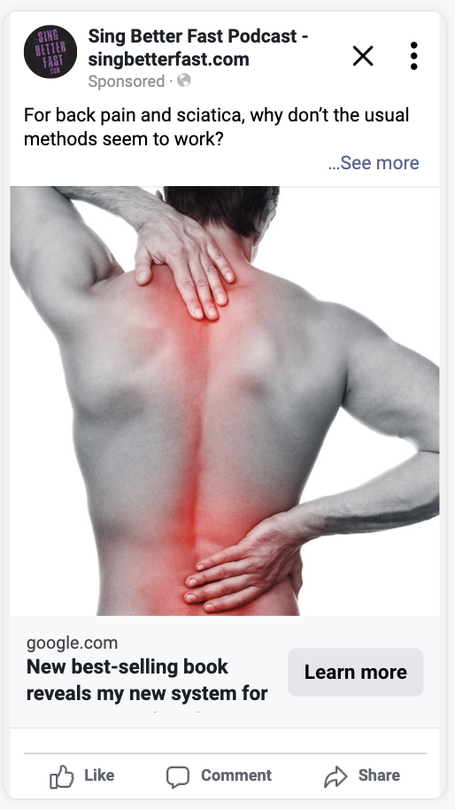
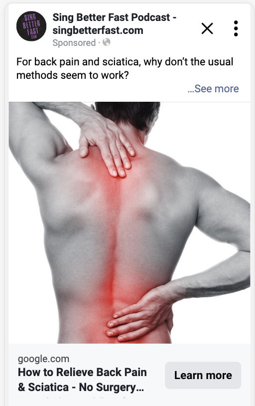
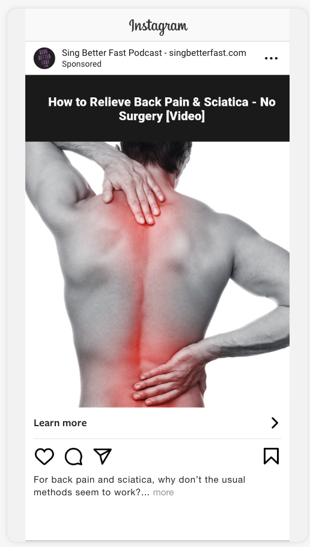
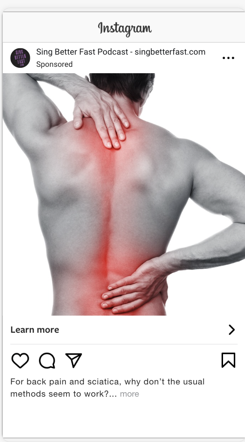
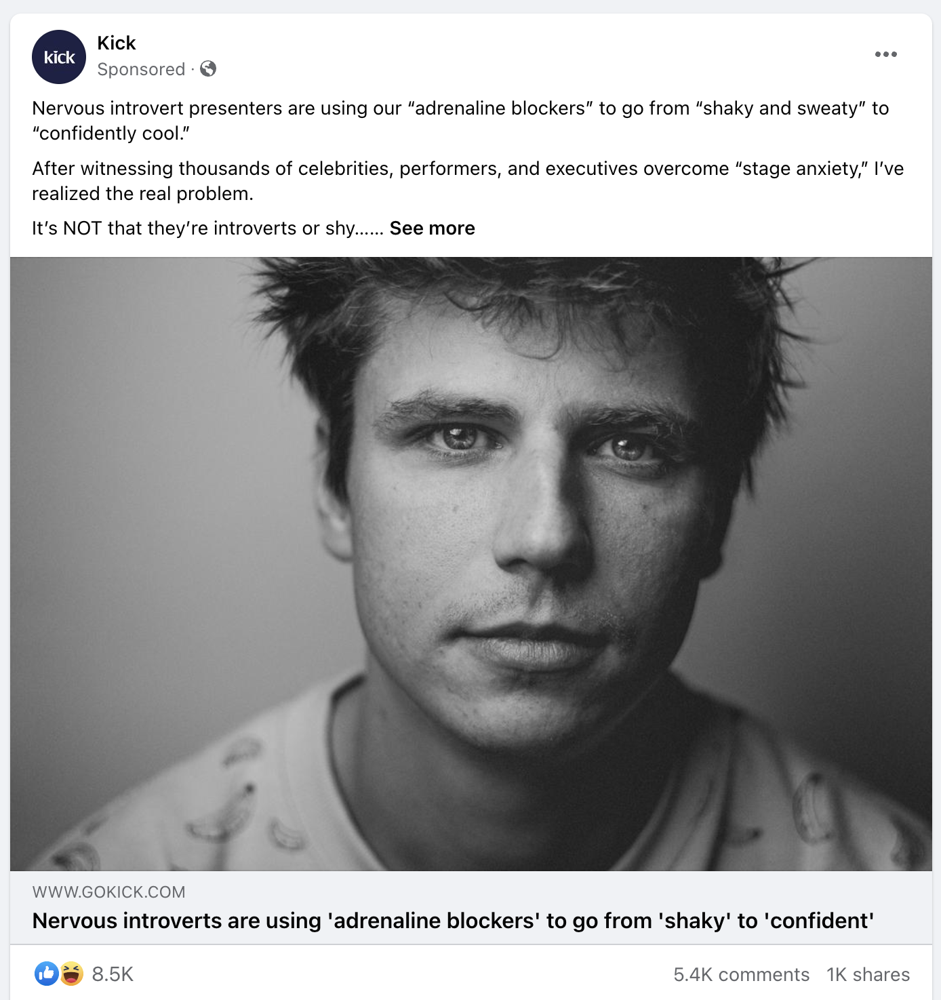
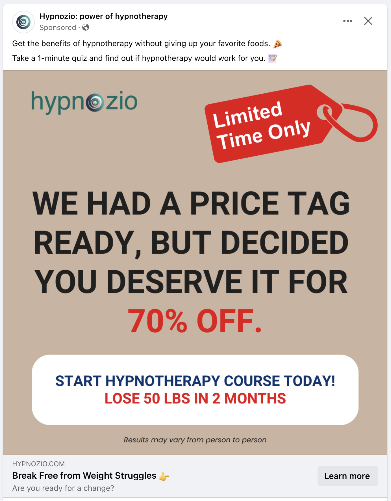
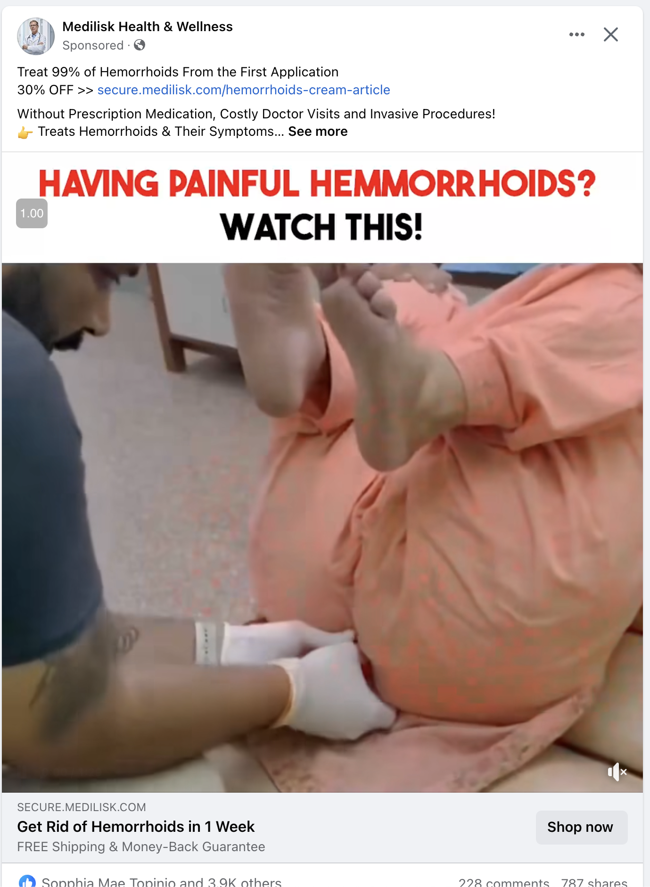
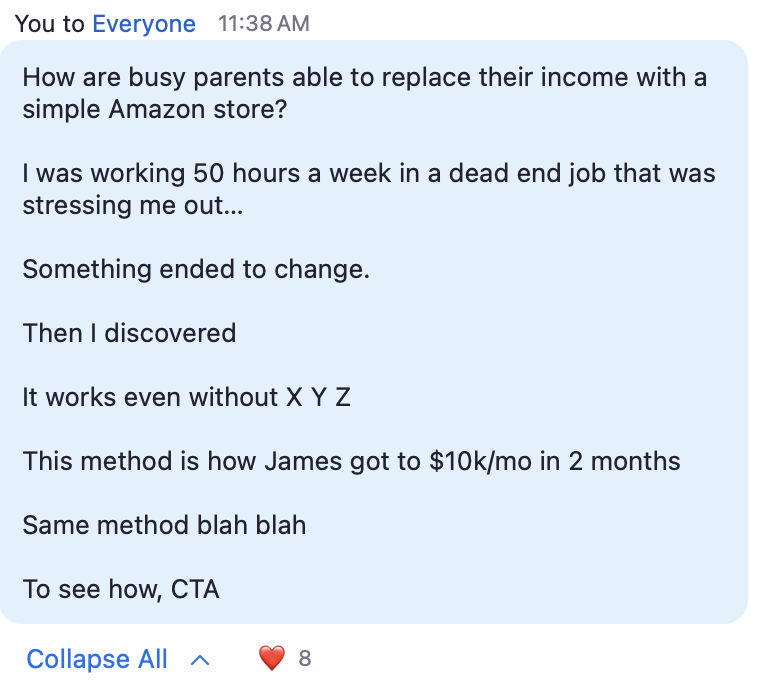
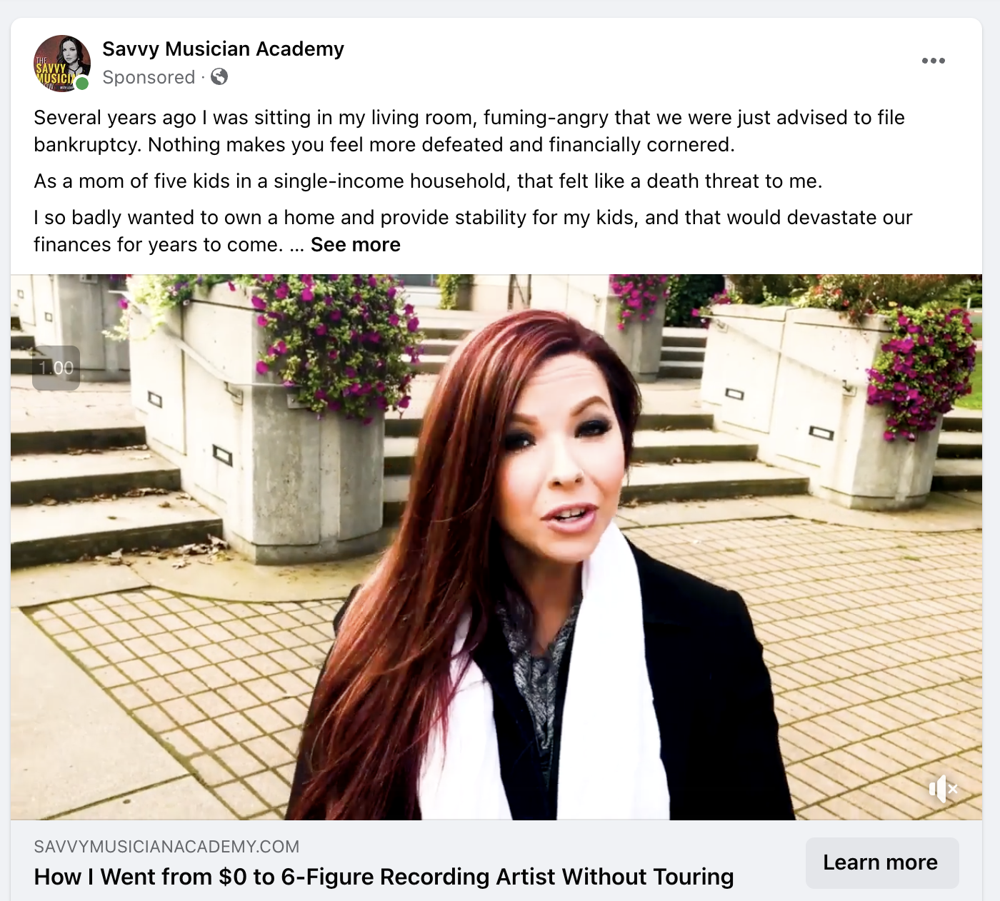

# Writing Ad Copy 101

Master the art of high-converting marketing.

> Images live in the `images/` folder next to this file. Every image has a written description under it so the example still makes sense when only the text is read.

---

## Table of Contents

1. [Purpose of an Ad](#purpose-of-an-ad)
2. [Headline](#headline)
   - [Dan Kennedy Test (Classified Ad)](#dan-kennedy-test-classified-ad)
   - [Headline Variations](#headline-variations)
   - [Descriptions](#descriptions)
   - [Mobile Placement Compatibility](#mobile-placement-compatibility)
3. [Ad Opener / "Alternative Headline"](#ad-opener--alternative-headline)
4. [Ad Body Copy](#ad-body-copy)
5. [Sample Ads](#sample-ads)
   - [Ad 1: Belief Shifter / Misconception / Root Cause](#ad-1-belief-shifter--misconception--root-cause)
   - [Ad 2: Why What How](#ad-2-why-what-how)
   - [Ad 3: Hate / Story](#ad-3-hate--story)
   - [Ad 4: Why / Root Cause / Outcome](#ad-4-why--root-cause--outcome)
   - [Ad 5: Internal Dialogue / Story](#ad-5-internal-dialogue--story)
   - [Ad 6: Why / What's Wrong With Me / Root Cause](#ad-6-why--whats-wrong-with-me--root-cause)
   - [Ad 7: Remove the Retreat](#ad-7-remove-the-retreat)
6. [Ad Creative](#ad-creative)
7. [Ad Swipes](#ad-swipes)

---

## Purpose of an Ad

**Prime them to click, then buy.**

1. **Stop the scroll. Capture curiosity / intrigue.**
   - Headline
   - Ad opener / "Alternative Headline"
   - First 3 seconds of video / Image(s)
2. **Build intent / desire. Establish beliefs.**
   - Headline
   - Rest of the ad copy
   - Rest of the video / images

---

## Headline

A headline should hit one or more of these:

- Outcome / Transformation
- What the "thing" is
- Mechanism / Steps / Process
- Direct benefit
- Ultimate benefit

### Dan Kennedy Test (Classified Ad)

If your ad appeared in the Classifieds section of the newspaper, with only the headline and a phone number, would people respond to it?

| Fails the test | Passes the test |
|---|---|
| 51% Off! | How to relieve back pain & sciatica - no surgery |
| Enroll Today | The "Secret" Way to retire early |
| Buy 2 for only $99 | From "dad bod" to "daddy" |
| Free book | Get dental patients the RIGHT way \| 4-Step Process |
| FREE 3-day delivery | Never cook or wash dishes again! |
| Buy my course | I went from "alone" to "loved" with THIS |
| 6wk Program | |

### Headline Variations

**Add the "thing" at the end**

- Hollywood's "Fitness Secret" For Men
  - Fitness Secrets from Hollywood? For Men Only
- Hollywood's "Men's Fitness Secret" | 6wk Program

**Add "without" (the thing they don't want / the objection)**

- Relieve back pain & sciatica
- Relieve back pain & sciatica | no surgery
  - Without surgery

### Descriptions

Fill-in-the-blank templates for the description line under the headline:

- Get Your [Free] [Workshop / Lead Magnet] Now!
- Over (number)+ [Target Market] Helped
- Ready for [Outcome]?

### Mobile Placement Compatibility

Long headlines get cut off on mobile. Check every placement before you launch.

> **Image 1: Facebook feed, headline too long.** A Sing Better Fast Podcast ad. Primary text reads "For back pain and sciatica, why don't the usual methods seem to work?" above a black-and-white photo of a man's bare back with the spine and lower back glowing red. The headline under the image is cut off mid-sentence: "New best-selling book reveals my new system for..." The reader never sees the payoff. This is the BAD example.

> **Image 2: Facebook feed, headline fits.** Same ad, same image, same primary text. The headline now reads "How to Relieve Back Pain & Sciatica - No Surgery..." The outcome and the "without" objection both show before the cutoff. This is the GOOD example.

---

## Ad Opener / "Alternative Headline"

**Goal: Stop the scroll, capture curiosity / intrigue.**

The opener is the first line of the primary text. Treat it like a second headline.

**"Internal Dialogue" Opener**
> "What's wrong with me? Why can't I lose this weight?" she whispered. "I feel like such a failure..."

**"Why Problem" Opener**
> Why are piano players struggling to play jazz?
>
> Why are (target audience) struggling to (get outcome)?
>
> Why are coaches struggling to book the sales calls they need? It's because the market has shifted in a way very few have noticed...

**"Why Contrast" Opener**
> Why do some copywriters seem to get all the clients they want, easily... But others struggle to get any leads at all?

**"How Others Succeed" Opener**
> How are busy moms starting their own online businesses, bringing in thousands extra a month?

**"Case Study" Opener**
> Wayne lost 15 pounds in 1 month with THIS
>
> WHOA! Wayne lost 15 pounds in 1 month! James lost 20 pounds in 2 months, and he feels confident again. William is down 10 pounds in 3 weeks and his sleep is better...

**"Secret" Opener**
> There is a "secret" method women are using to get matches and dates with quality men who are looking for more than just "fun"...

**Safety Opener**
> Is your bathroom safe?
>
> How do you know if your bathroom is safe?

**Real Reason Opener**
> What's the REAL reason women can't find quality men? Probably not what you think...

**"When is the last time you didn't suffer" Opener**
> When was the last time you had a day without pain? For people struggling with back pain or sciatica...

### Where the headline shows on Instagram

On Instagram the headline does not sit under the image like it does on Facebook. Either put it on the image or accept that the opener carries the whole load.

> **Image 3: Instagram feed, headline baked into the image.** Same back-pain photo. A black bar across the top of the image carries white text: "How to Relieve Back Pain & Sciatica - No Surgery [Video]". Below the image is a "Learn more" link and the caption "For back pain and sciatica, why don't the usual methods seem to work?... more". The headline is visible without tapping anything.

> **Image 4: Instagram feed, no headline on the image.** Same ad, same photo, but the black headline bar is gone. All the reader sees is the photo, a "Learn more" link, and the same caption. The headline never appears. The opener has to do all the work.

---

## Ad Body Copy

**Goal: Build intent / desire.**

Ingredients to mix and match:

- Testimonials / reviews / social proof
- Root cause / underlying problem
- Mechanism of the problem / mechanism of the solution
- Outcome / transformation
- Disqualifying alternatives
- Emotionality
- Story
- Create hope
- Empowerment
- Absolution of past failure
- "Remove the retreat"
- Belief work
- Digestibility
- Bring the reading level down

---

## Sample Ads

### Ad 1: Belief Shifter / Misconception / Root Cause

**Opener v1**
> What's the biggest misconception about ADHD in kids? That medication is the only way to treat it...

**Opener v2**
> Why are parents struggling with their children's ADHD symptoms, even after trying lots of medications?

**Body copy (all versions)**

The problem with medications is that they merely "mask" the symptoms, without addressing the root causes of ADHD.

It often starts with one medication. Sometimes it works well...

But for many children (including my own son), the first medication stops working.

And even worse, the meds often have very serious side effects.

And so the doctors just prescribe a second medication to deal with the side effects of the first one.

And then a third medication... And then a FOURTH.

These strong medications can have negative effects on children's developing brains and growing bodies that can affect them for the rest of their lives.

There are many underlying causes of ADHD symptoms. And every child is different.

A blanket "one size fits all" prescription doesn't address what each unique child needs.

And that's why meds often don't work.

I want you to know something - there is another way.

There is a way to reduce ADHD symptoms naturally, without meds.

My own son was diagnosed with ADHD at the age of 4, and we tried one medication, added another, and added another... But no matter how many meds the doctors gave him, nothing was working.

After years of trial and error, study, and even becoming a board-certified nutrition and health practitioner, I figured it out!

I was able to reduce my son's ADHD symptoms so much, that he doesn't exhibit them at all anymore.

And I have done this for over a thousand other families.

Far too often, children are prescribed medication when it isn't the best path for them.

I have a 3-Step Blueprint I have developed to help caring parents reduce their children's ADHD symptoms naturally - without medication.

I'll explain everything in a video I made for you. It's a gift from me to you.

Click the link, and on the next page, you'll learn how you too can reduce ADHD symptoms naturally - without risky meds.

---

### Ad 2: Why What How

"Why can they sing high notes, but I can't?" my vocal student asked. "My voice flips and cracks. It's embarrassing..."

This is a common problem singers face. Luckily, it's pretty easy to fix.

Singers are often told, "You are stuck with the vocal range you are born with."

Singers are told they have a "voice type", and they have to sing in the small vocal range that fits their "voice type."

Fortunately, those are not true!

You CAN expand your vocal range, both higher and lower. You just need to know how.

The first step is to develop proper vocal technique.

With proper vocal technique, it's MUCH easier to sing high notes without strain or pushing.

Instead of feeling like you are "pushing" on high notes, you'll feel them "float" up effortlessly.

With proper vocal technique, hitting the high notes becomes a lot easier, without "flips", "cracks", or "breaks" in the voice.

Click, swipe, and go to the next page to see a bunch of testimonials from our students.

Sign up today. Start singing better tomorrow.

👇 Testimonials 👇

"My highest note was an A4, and while I'm still learning and training, I can hit up to an F5 in a more robust tone." - Heyden Smith, 20, Oklahoma

"Since getting the Vocal Break Eraser, I can sing higher, speak more articulately, and I don't have to strain to get my top notes. I was skeptical that an online program could have any major impact, but the coaches are the real deal. If you want a more powerful voice that lasts long and stays healthy, this is the first place to look." - Daniel A. 38, California

"Two weeks ago I did an open mic, and my wife was absolutely effusive in her praise. She clearly heard a big difference. The Vocal Break Eraser has been a big help. I am singing the top end of my range much better and stronger." - Brian Gardiner, 57, Ontario Canada

Don't let your dreams be dreams! A month from now, you will wish you had started today! Click now.

---

### Ad 3: Hate / Story

"I hate my voice," David said. "I want to like my voice." It was our first singing lesson.

I could hear the sadness in this singer's voice as he spoke.

"I have never liked my voice. I sound dull, boring, and overall kinda bad," he said. "I love singing, but I'm afraid of singing in front of someone else."

I asked him, "Would you be open to trying some vocal exercises with me?"

He hesitated, sighed, and then mumbled, "I guess so." He had taken several lessons and bought a bunch of courses, but nothing seemed to work for him.

I walked him through the Vocal Power Triad. I showed him how to breathe correctly (almost everyone does this wrong). I taught him proper support. Then he learned good placement so he stopped sounding "dull" and "down in the throat."

I had him sing a few lines of Amazing Grace. He seemed nervous, but he did it anyway.

After he finished, he got a big smile on his face.

He said, "That is the best I have ever sounded in my entire life." We were only 15 minutes into our lesson.

I nearly cried. I was so happy for him.

And what we covered - breathing, support, placement - are in Video 1 of our training program.

As we continued our lesson, I taught him so much more:

- correct posture for singing (why don't more people know about this?)
- how to easily sing higher notes without "reaching" or "pushing"
- how to tell if you're tensing the neck. (Lots of people say to "stay relaxed" while singing, but never explain exactly how to do that. I do teach you that.)

If you want to like your voice more than you do now...

If you want to sing effortlessly, without feeling strained or tense...

If you want to sound so good that people stop talking so they can listen to you sing...

If you want to be able to sing night after night, without losing your voice or getting hoarse...

If you want your friends to brag about you...

If you want the crowds to clap and chant your name...

Then the first step is to check out this video.

I can't wait to see you on the stage!

---

### Ad 4: Why / Root Cause / Outcome

Left column is the real ad. Right column is the fill-in-the-blank template.

| Real ad (back pain) | Template |
|---|---|
| Why are people struggling to get rid of awful back pain and sciatica? | Why are [target audience] struggling to [solve problem / get outcome]? |
| Even after trying pain relief meds, yoga stretches, injections, and electrical stimulation gadgets... | Even after trying all the common approaches... |
| So many are still dealing with intense pain, and having a hard time doing normal, everyday tasks... | So many are still dealing with problems, having a hard time doing anything... |
| The reason these other methods don't work is because they only mask the symptoms of the pain - rather than fixing the root causes. | The reason these other methods don't work is because [fatal flaw]. |
| As a physical therapist, I have made it my life's work to help people recover from back pain and sciatica. And not just for a few days or weeks, but long-term. | As an [expert], I have made it my life's work to get people [this outcome] fast, and for good! |
| After working with people for over 20+ years, I have developed and refined a simple, gentle method for relieving pain. | After working with people for [a long time / years / whatever], I have developed and refined this [super secret special awesome sauce method]. |
| You see, it's not just about doing more stretches. | It's not just about [whatever they are trying now / what they think the problem is now]. |
| Something most people don't know is - stretching can make it harder to relieve pain. | Something most people don't know / realize is that [common approaches make it WORSE]. |
| That is because of the "stretch reflex" - when we stretch, the muscles tense in response to the stretch. | That is because of [reason why it gets worse]. |
| Stretching isn't the answer - at least, not as it is commonly understood and taught. | And that is why that is not the answer... |
| The reason I've been able to help so many people is with Simple, Gentle Movements. | The reason I've been able to help so many people is because of [mechanism of the solution / Master Key]. |
| They are easy, and they don't hurt. In fact, they often feel very good. | |
| To see what my method is, how it works - and more importantly - how to finally escape from the pain... | To see what my [solution / method / process] is, [click / swipe / whatever], go to the next page and [see a free video / buy my book / whatever]. |
| Simply click the link on this post. It will take you to the next page, where I have a video that explains how it all works. | |
| Many of my clients have seen relief in just a matter of a few days. | |
| This works for people who have tried everything - meds, stretches, exercise, injections, gadgets... | |
| And it even works for people who have given up hope - and simply decided to live with the pain. | |
| Go ahead and click the link, and I'll explain everything in the free video on the next page! | |

---

### Ad 5: Internal Dialogue / Story

I didn't feel good in my wedding dress. I was so embarrassed. I wanted to hide from the camera...

I looked at pictures of my wedding. It was supposed to be my happiest day. But I felt sad deep down...

Everyone told me I looked beautiful...

But I knew they were all secretly judging me.

I kept a smile on my face for all my family and friends, but deep down, I wanted to cry.

I had tried so hard to lose weight for my wedding, but I could never lose more than a few pounds... and then weight would come back on - and then some!

And the closer it got to the date, the more stressed I became and the more weight I put on...

I felt out of control. Hopeless. Like a failure.

That girl wanted to look beautiful on her wedding day, for her family, for her husband, and for herself... but instead, she felt fat and unattractive.

I cringe thinking about that day. I can't even look at those photos without feeling sad.

The dress was stuffed in the back of my closet for years, until one day I tried it on...

And it didn't fit.

I remember sitting on my bed, feeling a "rock bottom" moment...

I had to do something.

I tried all the usual stuff:

❌ The popular diets
❌ Meal delivery services
❌ "Diet pills"
❌ Supplements

But no matter what I tried, I ended up failing.

I'm a smart, strong woman... Why couldn't I figure this out?

And after trying all of that, wasting months of my life and lots of money, with all the frustration and confusion along the way...

I finally found the answer. I lost 28 pounds.

It's a certain approach to nutrition that doesn't require cutting out all the enjoyable foods.

When done the right way, it can trim down the extra pounds without feeling deprived.

I have put it all together in a simple 1-hour mini-course.

After going through this easy-to-understand course, it becomes MUCH easier to get healthier and slimmer.

I have helped lots of women improve their relationship with food... And now, they feel a renewed sense of self-confidence, self-respect, and self-love.

I will guide you. With care and gentleness. And without judgment.

So go ahead. Click the link and join me on the next page.

\- Name 💗

---

### Ad 6: Why / What's Wrong With Me / Root Cause

"UGH! Why can't I lose this weight?" she asked, voice quivering... "What is wrong with me?"

"I've tried everything.

Low carb. High carb. Low fat. High fat. Eating 6 times a day. Eating once a day. No sugar. And all the diets...

Sometimes, I lost a little weight, but it always came back.

It feels like no matter what I do, it isn't working...

What should I do?"

I get messages like this all the time.

So what is the problem?

After helping many busy mothers become healthier and fitter, I've learned why it feels impossible...

Most diet and exercise plans are too "one size fits all."

But you are unique. So you need a plan that is perfect for YOU, your dreams, and your life.

If you've tried to lose weight before and felt like you failed...

It isn't that you failed. It's because the plan was made for someone else.

It wasn't made for you.

When your plan is made just for you - your life, your goals, your body, your schedule - getting slimmer and healthier is easier than you might think.

I want to help you with a diet and exercise plan that's perfect for you.

To start, click to chat with me. I'll guide you with care and gentleness. And without judgment!

Click to send me a message! 💪

---

### Ad 7: Remove the Retreat

What is the biggest misconception about investing and retirement? That "low-risk low-return" investments are a path to wealth...

To build wealth, retire comfortably, or even retire early -

Getting only 5% a year (after taxes and inflation) with a "stable" investment is the worst thing you can do...

Because what you risk is not assets - you risk time.

Taking the "safe" route means risking years of my life I can never get back.

---

## Ad Creative

**Goal: Stop the scroll, capture curiosity / intrigue, build intent / desire.**

**GOAL: Move them from Closed to Receptive / Open. Engineer beliefs.**

1. 2-minute video clip of a success story / testimonial. Multiple different success stories, with and without music. Color enhancements.
2. Intriguing image.
3. Picture of [successful outcome]. Text over the image: "FINALLY [emotional outburst of joy, positive outcome]!"
4. Add the text "Free Workshop / Webinar / Cheat Sheet" above or below any ad images / videos, in a bright color.
5. Screenshot of an interesting part of the product or software dashboard (charts, colorful graphs, map, collected payments log, etc.). Slightly blurred out, used as the background. Use a headline from the Headlines section of this document, overlaid on top of the slightly blurred screenshot. Red or green arrow pointing to the headline.
6. Existing FB / IG video or image post that already has lots of engagement and is visually appealing. Add text above and/or below.

---

## Ad Swipes

Real ads worth studying. Each one is broken down so you can see which pattern it uses.

### Swipe 1: Kick (public speaking)

> **What the ad looks like.** Facebook ad from "Kick". Black-and-white close-up photo of a young man with messy hair staring straight into the camera, serious face. Very high engagement shown at the bottom: 8.5K reactions, 5.4K comments, 1K shares.
>
> **Primary text:**
> "Nervous introvert presenters are using our 'adrenaline blockers' to go from 'shaky and sweaty' to 'confidently cool.'
> After witnessing thousands of celebrities, performers, and executives overcome 'stage anxiety,' I've realized the real problem.
> It's NOT that they're introverts or shy... See more"
>
> **Headline:** Nervous introverts are using 'adrenaline blockers' to go from 'shaky' to 'confident'
>
> **Patterns used:** "How Others Succeed" opener. Named mechanism in quotes ("adrenaline blockers"). Before-and-after transformation ("shaky and sweaty" to "confidently cool"). Authority via volume ("thousands of celebrities"). "Real Reason" curiosity gap right before the See more cutoff.

### Swipe 2: Hypnozio (weight loss)

> **What the ad looks like.** Facebook ad from "Hypnozio: power of hypnotherapy". Tan background image. Hypnozio logo top left, red "Limited Time Only" price tag top right. Giant bold black text fills the middle: "WE HAD A PRICE TAG READY, BUT DECIDED YOU DESERVE IT FOR 70% OFF." A white rounded box below reads "START HYPNOTHERAPY COURSE TODAY! LOSE 50 LBS IN 2 MONTHS." Small italic disclaimer "Results may vary from person to person."
>
> **Primary text:**
> "Get the benefits of hypnotherapy without giving up your favorite foods. 🍕
> Take a 1-minute quiz and find out if hypnotherapy would work for you. 📝"
>
> **Headline:** Break Free from Weight Struggles 👉
> **Description:** Are you ready for a change?
>
> **Patterns used:** "Without" objection handling in the opener (without giving up your favorite foods). Low-commitment CTA (1-minute quiz). Outcome plus timeframe on the image (50 lbs in 2 months). "Ready for [Outcome]?" description template. Urgency and discount as the creative hook.

### Swipe 3: Medilisk (hemorrhoid cream)

> **What the ad looks like.** Facebook video ad from "Medilisk Health & Wellness". Video thumbnail has a white banner across the top with big red text "HAVING PAINFUL HEMMORRHOIDS?" and black text "WATCH THIS!" Below it is a still from the video: a doctor in a blue shirt and white gloves examining a patient in an orange gown lying on a table. Engagement at the bottom: 3.9K reactions, 228 comments, 787 shares.
>
> **Primary text:**
> "Treat 99% of Hemorrhoids From the First Application
> 30% OFF >> secure.medilisk.com/hemorrhoids-cream-article
> Without Prescription Medication, Costly Doctor Visits and Invasive Procedures!
> 👉 Treats Hemorrhoids & Their Symptoms... See more"
>
> **Headline:** Get Rid of Hemorrhoids in 1 Week
> **Description:** FREE Shipping & Money-Back Guarantee
>
> **Patterns used:** Safety / problem call-out on the creative ("Having painful...? Watch this!"). Big specific claim (99% from first application). Triple "without" stack (no prescription, no doctor visits, no procedures). Outcome plus timeframe headline (1 week). Risk reversal in the description.

### Swipe 4: Amazon store ad outline (chat screenshot)

> **What the image is.** A screenshot of a Zoom-style chat message from "You to Everyone" at 11:38 AM with 8 heart reactions. It's a rough skeleton of an ad typed live, not a finished ad. Text reads:
>
> "How are busy parents able to replace their income with a simple Amazon store?
> I was working 50 hours a week in a dead end job that was stressing me out...
> Something ended to change.
> Then I discovered
> It works even without X Y Z
> This method is how James got to $10k/mo in 2 months
> Same method blah blah
> To see how, CTA"
>
> **Why it's here.** It shows the bones of an ad in order: "How Others Succeed" opener, personal story of pain, discovery moment, "without" objection line, case-study proof with a number and a timeframe, tie-back to the same method, then the call to action. Fill in the blanks and you have an ad.

### Swipe 5: Savvy Musician Academy (music business)

> **What the ad looks like.** Facebook video ad from "Savvy Musician Academy". Video still of a woman with long red hair, dark eye makeup, black coat and white scarf, talking to camera outdoors in front of concrete planters full of purple flowers. Casual, direct-to-camera feel.
>
> **Primary text:**
> "Several years ago I was sitting in my living room, fuming-angry that we were just advised to file bankruptcy. Nothing makes you feel more defeated and financially cornered.
> As a mom of five kids in a single-income household, that felt like a death threat to me.
> I so badly wanted to own a home and provide stability for my kids, and that would devastate our finances for years to come. ... See more"
>
> **Headline:** How I Went from $0 to 6-Figure Recording Artist Without Touring
>
> **Patterns used:** Story opener with a "rock bottom" moment (bankruptcy). Heavy emotionality (defeated, cornered, death threat). Identity match for the target (mom of five, single income). Headline is transformation ($0 to 6 figures) plus "without" the thing they dread (touring).
