# Writing Ad Images 101

Reference doc for generating high-converting Meta (Facebook / Instagram) static ad images with AI image models (OpenAI gpt-image-2 and Google Nano Banana Pro / Nano Banana 2). Built September 2026 from live Meta Ad Library swipes plus 2026 creative benchmark reports. Companion to `writing-ad-copy-101.md` (the words around the image). This doc covers the picture itself.

Swipe images live in `swipes/`. Every one is described in words in Section 8, so this file works even if the images never load.

---

## 1. What makes a static ad image convert

A static image has one job: stop the thumb and hand the reader one idea in under a second. Everything below serves that.

**The numbers that matter (2026):**
- Static images still carry most direct-response spend. Motion's 2026 Creative Benchmarks ($1.29B in Meta spend, 578,750 creatives) found "Text only" and "Product image with text" are the top two asset types by hit rate AND by spend-use ratio. Plain text on a colored box beats high-production work at finding winners.
- Only about 5% of creatives become winners (Motion). Small accounts see 3.8%, large ones 8.2% (Taylor Sicard). Plan on volume, not one perfect ad.
- Statics fatigue faster than video: 7 to 14 days at scale spend vs 14 to 28 for video (Superscale). Frequency above 2.5 to 3.0 is the early warning.
- Statics with more than about 20% of the canvas covered by text underperformed in Superscale's testing. Big text, not lots of text.

**The nine rules:**

1. **Stop the scroll with contrast, not decoration.** In a static, "motion" is contrast: a bright subject on a dark ground, red on white, a face against a flat color. The contrast has to mean something (a transformation, a product in use, an emotion), not just look loud.
2. **One idea per image.** One headline, one visual, one promise. If the reader has to choose what to look at, they scroll. Every swipe in this doc passes this test. Cole Gordon's red card says one thing: "We pack your calendar with calls or you pay nothing."
3. **Readable at thumbnail size.** Test every image at 300px wide. If the headline is not readable there, it does not exist. Most winners use 3 to 8 word headlines set at roughly 8 to 12% of canvas height.
4. **Clear text hierarchy.** One dominant line (the hook), one supporting line (the payoff or detail), optionally one tiny line (source, date, disclaimer). Three sizes max. Brunson's FHL ads: giant "WHO WILL BE SPEAKING", medium "$24,535.97 IN FREE BONUSES", small "Watch the full reveal now."
5. **Faces and eyes.** A real face looking at the camera (or at the headline) is the most reliable attention hook. Founder photos beat stock. Dan Henry, Hormozi, Cardone, Gadzhi, Porterfield, Kutcher, Suby all lead with their own face. When the face looks toward the text, the eye follows.
6. **Native beats polished (for finding winners).** Notes-app screenshots, tweets, iPhone photos, plain text on a flat color. These do not trigger the "this is an ad" filter. Gadzhi's lo-fi photo with a cat and a Stories-style label runs right next to his polished version. Polished creative is for scaling a proven idea and for brand credibility, not for discovery.
7. **Proof on the image.** A number, a screenshot, a stack of books, a review count. Suby: a pallet of 10,000 books. Skool: "$2,000 MRR". Cole Gordon: "40 new sales calls last month." Proof that can be seen beats proof that is claimed.
8. **Offer clarity.** If there is an offer, the image should carry it: FREE, $997 crossed out, "5-Day Challenge", "$72 Free Welcome Kit". Motion's top format by hit rate is the "Offer-First Banner" (8.6% hit rate, 29.3% of spend).
9. **Small logo, or none.** Logo at 8 to 12% of canvas height, top-left or bottom-right. Centered or oversized logos signal "ad" before the reader decides to engage (Superscale). Founder-led ads often skip the logo entirely.

---

## 2. The proven static formats

Each format below has rules and the real swipes that show it. Formats are ranked roughly by how often they show up in long-running ads from the advertisers researched.

### (a) Big bold text-only / "ugly ad" / notes-app or tweet screenshot

The highest hit-rate asset type in Motion's 2026 data. No photo. Just words on a color.

**Rules:**
- One flat background color (red, black, navy, white, or a brand color). No gradients needed.
- One headline, 3 to 12 words, filling 60 to 80% of the width, centered.
- Font: heavy sans-serif (Inter Black, Archivo Black, Helvetica Bold) for the "shout" version. Serif or system font for the "note" version.
- Notes-app version: white or off-white card, black system text, short lines, one emoji max, phone-like padding.
- Tweet version: real tweet UI (avatar, name, handle, timestamp, like icons). The tweet is 1 to 2 sentences and ends with a pointer ("Click below to learn more 👇").
- Long-copy version works too: a paragraph of small text on a dark card. It reads as a letter, not an ad. Use only if the primary text is short, otherwise you repeat yourself.
- Never more than about 20% of canvas covered in ink for the shout version. The long-copy version breaks this rule on purpose, so treat it as its own test.

**Swipes:** `cole-gordon-red-text-only-pay-nothing.png`, `cole-gordon-tweet-screenshot-setter.png`, `cole-gordon-long-copy-40-calls.png`, `dan-martell-black-notes-text-apply.png`, `dan-martell-oct-26-27-big-type.png`, `hormozi-navy-text-roofing-owners.png`, `skool-black-card-side-hustle.png`, `grant-cardone-resignation-email-screenshot.png`

### (b) Founder or face + headline

The default for info products and coaching. Face on one side, headline on the other, or headline over the face.

**Rules:**
- Real photo of the founder, cut out or on a simple background. Eyes visible, looking at the camera or toward the headline.
- Headline is the hook from the primary text, shortened to 3 to 8 words, OR a "who this is for" callout ("Roofing owners doing $1M+ a year").
- The founder is doing something: holding a book, holding a sign, pointing, sitting at a table. A prop gives the eye a second thing to land on after the face.
- Speech-bubble variant: put the headline in a white rounded bubble beside the founder's head. Reads as the founder talking.
- Handwritten-sign variant: founder holds a real (or generated) whiteboard with the hook in marker. This is the highest-signal "ugly" version of this format.
- Run 3 to 6 audience variants with the same layout and only the callout changed (Hormozi: roofing / accounting / pest control / mortgage / law firms).

**Swipes:** `hormozi-holding-books-viral-ebook.png`, `hormozi-speech-bubble-real-estate.png`, `dan-henry-handwritten-sign-1m-webinar.png`, `dan-henry-change-my-mind-table.png`, `dan-henry-orange-knowing-how-to-close.png`, `iman-gadzhi-lofi-cat-last-chance.png`, `amy-porterfield-20k-to-100k-months.png`, `frank-kern-ojoy-free-accounts-blue.png`

### (c) Before / after or transformation

**Honest note:** none of the researched info-product or SaaS advertisers were running a literal split before/after static in the US in September 2026. The format is common in fitness, skin, home, and app verticals (Superscale reports a 2x CPI drop for one app using a before/after split). What the researched advertisers DO run is the transformation stated in words: a "from X to Y" headline, or a price before/after.

**Rules:**
- Literal version: two panels, left = before, right = after, same framing, same lighting, one small label each ("Before" / "After" or "Day 1" / "Day 30"). No headline needed beyond the labels.
- Word version: headline states the jump with numbers. "From $20,000 months to $100,000 months." "From zero subscribers to a real email list. In five days."
- Price version: old price struck through in red, new price large. "$1,000 → $497", "$97 → FREE".
- Never fake a physical before/after with AI for a real product claim. Meta will reject it and it is a policy violation. Use the word or price versions for offers.

**Swipes:** `amy-porterfield-20k-to-100k-months.png`, `grant-cardone-997-now-free.png`, `jenna-kutcher-free-mini-course-97-crossed.png`, `grant-cardone-3-day-summit-497.png`

### (d) Testimonial / review screenshot / proof stack

**Rules:**
- Quote in large serif or bold sans, in quotation marks, with the person's name and a one-line credential under it. Real names outperform initials.
- Put the quote on the photo of the person if you have it; otherwise on a flat color.
- Proof stack version: a number of things (10,000 books on pallets, 300+ creators, 6,500 reviews). Show the physical volume if it exists.
- "News" framing: a red "BREAKING NEWS" or "NEWS" tag above a headline written in third person ("Shark Tank investor gives away 10,000 books free"). Reads as coverage, not an ad.
- Stat card: one giant number and one small label ("$2,000 / MRR"). Nothing else.
- Screenshot of a real message (email, DM, text) works as proof AND as a pattern interrupt. Cardone runs a screenshot of a salesperson's resignation email as the image for an ad about compensation plans.

**Swipes:** `ag1-testimonial-quote-erica.png`, `sabri-suby-breaking-news-book-pallets.png`, `skool-2000-mrr-stat-card.png`, `cole-gordon-long-copy-40-calls.png`, `grant-cardone-resignation-email-screenshot.png`, `hubspot-loop-book-quote-card.png`

### (e) Product or book hero with benefit callouts

**Rules:**
- Product centered or slightly off-center, on a clean or in-context background, lit from one side.
- 2 to 4 callouts max, each a short label with a tiny icon or a thin line to the product. Callouts are 1 to 5 words.
- Headline above, one line. Optional small "Introducing" or "Free" tag.
- Book version: the book cover fills 40 to 60% of the frame, a big quote or the title's promise beside it. Or the founder holds the book (see format b).
- Flat-lay version for kits and bundles: every item laid out with its price or "Free" under it. Total value stated once.

**Swipes:** `ag1-stronger-mornings-callouts.png`, `ag1-72-free-welcome-kit-flatlay.png`, `ridge-nostalgia-meets-magsafe.png`, `hubspot-loop-book-quote-card.png`, `hormozi-holding-books-viral-ebook.png`, `jenna-kutcher-pinterest-guide-mockup.png`

### (f) Us vs Them comparison

**Honest note:** no researched advertiser had a classic two-column "Us vs Them" static live. The format remains standard in DTC (mattresses, supplements, software). Motion lists "Comparison" as a top static format for 2026. Rules are given so the skill can generate it.

**Rules:**
- Two columns. Left = "Them" (gray, plain, X marks). Right = "Us" (brand color, checkmarks). The Us column is slightly wider or brighter.
- 3 to 5 rows. Each row is 1 to 4 words. Rows must be true and provable.
- Headline above: "Why [product] instead of [category]?" or just the two names.
- Softer version: one column only, "The old way" struck through, "The new way" below it.
- Split-frame word version (seen at monday.com): left half "Work" with a messy visual, right half "...simplified." with a tidy one. Same idea, no table.

**Swipes:** none live from the researched set. See `monday-ui-screenshot-gazillion.png` for the "old way / new way" energy in a single frame.

### (g) Meme / native / lo-fi

**Rules:**
- Shot on a phone. Slight grain, uneven light, real room. Nothing cropped to perfection.
- Text is a Stories-style label (white pill with black text, or black bar with white text), not a designed headline.
- Or borrow a meme template the audience already knows ("Change My Mind" table sign). Put the claim on the sign.
- Or make it look like the product's own UI: a quiz, a poll, a "select the correct image" screen. Duolingo's static ads are just screens from the app with a question on top.
- Include a small imperfection on purpose (a cat, a can of drink, a plant). It sells "real."
- Same headline as the polished version. Test them head to head.

**Swipes:** `iman-gadzhi-lofi-cat-last-chance.png`, `dan-henry-change-my-mind-table.png`, `duolingo-quiz-time-native.png`, `ag1-ugc-scoop-iphone-shot.png`, `cole-gordon-tweet-screenshot-setter.png`

### (h) Offer / discount / free-thing callout

The "Offer-First Banner" is Motion's top format by hit rate (8.6%) and spend share (29.3%).

**Rules:**
- The offer is the headline. "FREE", "$997 NOW FREE", "Get Your $72 Free Welcome Kit", "We're giving away free accounts this week."
- Strike-through the old price in red or gray. New price or "FREE" in the loudest color on the canvas (yellow, green, or white on red).
- Add one urgency badge if true: "Will sell out", "This week", "Register before the deadline."
- Event version: date + city + one benefit line + a button-shaped CTA on the image.
- Color variants: Frank Kern runs the same "Free oJoy.ai accounts this week" layout in blue, red, pink, and yellow. Same words, different canvas. Cheap way to get 4 to 6 tests.

**Swipes:** `grant-cardone-997-now-free.png`, `grant-cardone-3-day-summit-497.png`, `frank-kern-ojoy-free-accounts-blue.png`, `russell-brunson-fhl-who-is-speaking-bonuses.png`, `ag1-72-free-welcome-kit-flatlay.png`, `clickfunnels-first-1000-free-5-day.png`

### (i) "Free training / workshop" lead-magnet cards

**Rules:**
- Word "FREE" appears once, large, or as a badge (Kutcher's "$97 → FREE" orange tab).
- Headline is the outcome, 4 to 9 words: "How to Grow an Email List of Buyers", "From zero subscribers to a real email list. In five days."
- Show the deliverable: a phone or tablet mockup of the guide, a workbook cover, a mini-course card.
- One button-shaped CTA on the image: "Sign up now", "Grab the free mini-course", "Get my free ticket."
- Founder avatar in a circle at the top is optional and adds trust.
- Pastel or bright single-color backgrounds work well here because the format is expected to look friendly, not corporate.

**Swipes:** `jenna-kutcher-free-class-email-list.png`, `jenna-kutcher-free-mini-course-97-crossed.png`, `jenna-kutcher-pinterest-guide-mockup.png`, `clickfunnels-first-1000-free-5-day.png`, `iman-gadzhi-lofi-cat-last-chance.png`, `dan-henry-orange-knowing-how-to-close.png`

### (j) Chart / dashboard / results screenshot

**Rules:**
- A real (or realistic) screenshot of the product UI, a dashboard, a Stripe or Skool earnings panel. Slight tilt or a soft drop shadow so it reads as a screenshot, not a flat design.
- One headline over it. The screenshot is proof of the headline, not decoration.
- Highlight one number. Circle it, or make it the only large text.
- Keep the UI legible at thumbnail size: crop tight to the one panel that matters.
- Stat-card version: one big number, one label, nothing else (Skool "$2,000 MRR").

**Swipes:** `monday-ui-screenshot-gazillion.png`, `skool-2000-mrr-stat-card.png`, `grant-cardone-resignation-email-screenshot.png`

### (k) Quote card

**Rules:**
- One quote, 6 to 20 words, in a serif (editorial feel) or heavy sans (punchy feel).
- Author line under it, small. Or a small "Keep reading →" if the quote is the hook and the ad copy continues it.
- Ground is a flat color, off-white, or a black-and-white photo of the speaker with the quote over the negative space.
- Yellow highlight on the key phrase is a proven trick (MasterClass: "YOU NEED TO STAND OUT" in yellow inside a white quote).
- The quote should be a belief, a contradiction, or a rule. Not a feature.

**Swipes:** `masterclass-nice-person-quote.png`, `amy-porterfield-serif-quote-card.png`, `hubspot-loop-book-quote-card.png`, `skool-black-card-side-hustle.png`

---

## 3. Copy ON the image

### Headline formulas that work on images (3 to 8 words)

- **Who it's for:** "[Audience] doing [milestone], this is for you." (Hormozi)
- **Guarantee:** "[Result] or you pay nothing." (Cole Gordon)
- **Big number:** "$997 → FREE". "10,000 books free." "$2,000 MRR."
- **Contradiction:** "The best webinars teach almost nothing." (Dan Henry)
- **Change my mind:** "[Bold claim]. Change my mind."
- **Last chance:** "LAST CHANCE to [outcome] with me live."
- **Question:** "Who will be speaking at [event]?!?"
- **Free thing:** "We're giving away free [thing] this week."
- **Outcome in a timeframe:** "From zero subscribers to a real list. In five days."
- **News:** "[Credible person] gives away [thing] just to prove it works."
- **Quote:** "Being a nice person who's good at your job is nowhere near enough."

Rules: no more than 8 words in the dominant line. Numbers as digits. One capital-letter style per image (either ALL CAPS shout or sentence case, not both in the same line).

### Font sizing for mobile

Working on a 1080px-wide canvas:
- Dominant headline: 90 to 140px (about 8 to 12% of a 1350px-tall canvas). Heavier weight is better than bigger size.
- Supporting line: 44 to 64px.
- Tiny line (source, date, disclaimer): 28 to 36px minimum. Anything smaller vanishes in feed.
- Line length: 3 to 5 words per line for the headline. Break lines by meaning, not by width.
- Check: shrink the image to 300px wide. The dominant line must still be readable.

### Where to place text (safe zones)

- **1:1 (1080x1080):** keep text inside the center 80%. 108px margin on all sides.
- **4:5 (1080x1350):** keep text inside the center; leave about 14% clear at top (~190px) and about 20% clear at bottom (~270px). The feed UI (page name, headline, CTA button) sits under the image, so bottom-heavy text competes with it.
- **9:16 (1080x1920):** keep everything inside the middle 1080x1420. Top 250px clear (profile bar), bottom 340px clear (CTA, caption, reply bar). Sides 6% clear (about 65px).
- Put the headline in the top third or dead center. Bottom third is for a CTA or nothing.

### How image text relates to primary text and link headline

Do not repeat. Escalate.
- **Image headline** = the hook, or the offer, in 3 to 8 words. It earns the read.
- **Primary text** (above the image) = the argument. It can be long. It opens with the same idea in a fuller sentence, then proves it.
- **Link headline** (under the image) = the action or the deliverable. "Download Free Scaling Frameworks." "Get My Free Ticket." "Reserve Your Ticket."
- Test: read image → link headline → primary text. If any two say the same thing in the same words, change one.
- Hormozi example: image says "Roofing owners doing $1M+ a year, these 5 Scaling Frameworks are for you." Primary text opens "Business Owners, real quick, can I get your email? I want to send you the exact frameworks we've used to scale." Link headline: "Download Free Scaling Frameworks." Three layers, no repeats.

### CTA on the image: yes or no?

- **Yes** for offers, events, lead magnets, and anything with a deadline. Draw it as a button (rounded pill, solid fill, 2 to 4 words: "Learn More", "Get My Free Ticket", "Sign Up Now"). Place in the bottom third, inside the safe zone.
- **No** for ugly ads, tweets, notes, quote cards, UGC photos, and news-style ads. A button breaks the disguise. Let the link headline do the CTA.
- Never two CTAs on one image.

---

## 4. Visual direction

**Color and contrast**
- Pick ONE dominant field color and ONE accent. Red/white, navy/white, black/white, yellow/black, brand blue/white, off-white/dark text.
- Text contrast ratio at least 7:1 (white on red, white on navy, black on yellow, black on off-white). Never light gray on white or mid-blue on mid-purple.
- Yellow highlight bar behind a key phrase is the cheapest way to add hierarchy.
- Red is the most common urgency accent across every advertiser researched. Green is used for "FREE" and money.

**Backgrounds**
- Solid flat color: best for text-only, offers, quotes, stat cards.
- Subtle gradient (one hue, dark to darker): fine for event and founder cutouts. Avoid rainbow or multi-hue gradients; they read as template.
- Real photo: for founder, UGC, product-in-use. Darken 20 to 40% behind text or place text on the empty side.
- Blurred screenshot or UI: for SaaS; the product is the background and the headline floats over it.
- Off-white paper texture: for notes, letters, and editorial quote cards.

**Photography style**
- Candid iPhone: front-camera or friend-shot, natural light, slight grain, real room. Use for discovery and lo-fi tests.
- Studio cutout: founder on a flat color or gradient, soft key light, slight rim light. Use for scaling and for offers.
- Event photos: stage, crowd, energy. Use for summits and live events.
- Product: one light source, soft shadow, in a real context (kitchen counter, desk) rather than pure white when possible.

**Composition**
- One focal point. Face, product, or headline. Never three.
- Leave negative space where the text goes. Plan the empty side before you shoot or prompt.
- Rule of thirds for face + text: face on one third line, text on the other two thirds.
- Subject should touch or point at the headline when possible (Cardone's speaker on stage under the summit title; Henry's mug and sign).

**Brand consistency**
- Same 1 to 2 fonts across every ad. Same accent color. Same logo position (small, corner) or no logo.
- Vary the format, not the brand system. Kern's four color variants keep type, layout, and photo identical.
- A one-ground, one-accent system (a dark neutral ground with a single saturated accent field, one display font plus one mono or grotesque) fits formats (a), (h), (i), (j), and (k) directly. Use the brand colors and fonts from the user's profile as that system.

---

## 5. Prompting guide: gpt-image-2 vs Nano Banana Pro / Nano Banana 2

> **Skill rule:** the /ad-image-gen skill uses only **gpt-image-2** (default) and **Nano Banana Pro**. Nano Banana 2 is documented below for comparison only. It is not offered as an option, because it loses on text accuracy and realism, and the cost saving doesn't matter at ad volumes.

### Which model for what (2026, from published tests)

| Job | Pick | Why |
|---|---|---|
| (a) Accurate text on the image | **gpt-image-2** first | OpenAI's model is built for text-heavy images; 2026 head-to-heads put it at roughly 99% character accuracy vs 94% for Nano Banana Pro (nanobanana.org), and it renders small body text as real words where NBP produced pseudo-text (OakGen). Nano Banana 2 is close on short headlines; NBP is fine for 1 to 3 short text elements. |
| (b) Face / likeness from a reference photo | **gpt-image-2** for one person, strict likeness | OpenAI documents gpt-image-2 as the pick for "identity-sensitive edits" and multi-image compositing; input fidelity is high by default. XDA's test found gpt-image-2 kept face, hair, eyes, and head position while Nano Banana's output drifted. Nano Banana 2 accepts more references (up to 4 characters, 10 objects, 3 style refs; Pro: 5 characters, 6 objects) and is better when you need several people or products in one scene. |
| (c) Photorealism (skin, lighting, product shots) | **Nano Banana Pro** | Scored 9.4 to 9.5 vs 7.5 to 7.8 on portrait realism in OakGen's 20-prompt test; strongest at lighting and skin. Use it for founder cutouts, UGC-style photos, product heroes. |
| (d) Editing an existing image | **Either. Nano Banana Pro slightly cleaner** | NBP edits drifted less across chained edits (8.8 vs 8.5, OakGen). gpt-image-2 is stronger when the edit involves changing or adding text. Both accept natural-language edits; Gemini supports semantic masking. |
| (e) Aspect ratios | **Both cover Meta's three sizes** | Nano Banana 2/Pro: preset ratios including 1:1, 4:5, 9:16, 16:9, 3:4, 2:3, 21:9, and resolution tiers 1K / 2K / 4K. gpt-image-2: any custom size up to 3840px on the long edge, both edges multiples of 16, max 3:1 ratio; common sizes 1024x1024, 1024x1536, 2560x1440. Note gpt-image-2 has no native 4:5 preset; request 1088x1360 (multiples of 16) or generate 1024x1280. |

Other facts worth knowing:
- Model IDs: `gpt-image-2` (OpenAI Images API, `images.generate` and `images.edit`), `gemini-3-pro-image` (Nano Banana Pro), `gemini-3.1-flash-image` (Nano Banana 2), `gemini-3.1-flash-lite-image` (Nano Banana 2 Lite).
- Every Gemini image carries a SynthID watermark (invisible). gpt-image-2 images carry C2PA metadata. Neither affects Meta delivery.
- Pricing (fal.ai, 2026): gpt-image-2 high quality about $0.21 per 1024x1024; Nano Banana 2 about $0.08 at 1K and $0.16 at 4K; Nano Banana Pro about $0.13.
- gpt-image-2 supports `quality: low | medium | high`. Use `high` for any image with text. Use `low` for layout ideation.
- Both models read plain English. Keyword spam ("8k, masterpiece, trending") does nothing.

### Universal rules for ad prompts

1. Put the exact headline in quotes, and say "verbatim, exactly as written, no other text." Spell tricky words letter by letter if needed.
2. Name the font style, weight, color, case, and position. "Heavy sans-serif, all caps, white, centered in the top third."
3. Name the aspect ratio and the safe zones. "4:5 vertical. Keep all text inside the middle 70% vertically."
4. Say "no extra text, no watermark, no logo unless specified, no fake UI elements."
5. Say what stays constant when editing. "Keep the person's face, hair, expression, and pose exactly the same. Change only the background."
6. For a reference face: attach the photo, then write "Use the attached photo as the exact likeness of the person. Same face, skin tone, hairline, facial hair, and eyes. Do not beautify or age."
7. One change per follow-up prompt. Do not rewrite the whole thing to fix one word.
8. Generate at 2K or 1080-plus width. Meta downsizes; you do not need 4K.
9. Ask for the text to be "cleanly rendered, high contrast, legible at small sizes."
10. Write the prompt in this order: canvas and ratio → background → subject → text (exact) → typography → constraints.

### Prompt templates by format

Placeholders in [brackets]. Copy, fill, paste.

**(a) Big bold text-only / ugly ad**
```
Create a [4:5, 1080x1350] Meta ad image. Flat solid [RED #E5322D] background, no texture, no gradient.
Centered text, exactly: "[WE PACK YOUR CALENDAR WITH CALLS OR YOU PAY NOTHING]"
Typography: heavy geometric sans-serif (like Archivo Black), all caps, pure white, 4 to 5 lines, line breaks by meaning, text block fills about 75% of the width and sits in the vertical center. Even letter spacing.
No other text, no logo, no icons, no people, no watermark. Render every word verbatim.
```

**(a) Notes-app / tweet screenshot variant**
```
Create a [1:1, 1080x1080] image that looks like a real iPhone screenshot of a tweet, on a plain white background with the tweet card centered and a soft shadow.
Tweet card: small round avatar with [description of founder photo, or "use attached photo"], display name "[Cole Gordon]" with a blue verified check, handle "@[ColeGordon]".
Tweet text, exactly: "[You + 1 Setter = $100k/month]" then a blank line then "[Click below to learn more 👇]"
Below the text a small gray line "[9:13 PM · Jun 26, 2026 · X]" and the four standard reply / repost / like / share icons in gray.
System font (San Francisco style), black text, realistic spacing. No other text anywhere. No extra UI.
```

**(b) Founder + headline**
```
Create a [4:5, 1080x1350] Meta ad. Use the attached photo as the exact likeness of the person: same face, skin, hair, beard, eyes, no retouching, no age change.
Scene: [the person] sits at a [black desk outdoors on a brick path], holding a [black coffee mug], looking straight at the camera with a slight smile. Natural daylight, candid iPhone photo feel, slight grain.
In front of the desk is a [white poster board] with hand-lettered black marker text, exactly: "[The best webinars teach almost nothing. If you're teaching, you're losing sales.]" and below it larger, exactly: "[CHANGE MY MIND]"
The sign text must be perfectly legible and spelled exactly as written. No other text, no logo, no watermark.
```

**(b) Founder + speech bubble callout**
```
[1:1, 1080x1080]. Use the attached photo for exact likeness. Dark [navy] studio background, soft key light from the left, subject in the left 55% of the frame, mid-shot, looking toward the right.
On the right side a white rounded speech bubble with a small tail pointing at the subject. Bubble text, exactly: "[Real estate brokerages] doing $1M+ a year, these 5 Scaling Frameworks are for you." with "[Real estate brokerages]" in bold and the rest regular weight, black, clean sans-serif, 4 lines.
No other text, no logo. Legible at small size.
```

**(c) Before / after (word or price version)**
```
[4:5, 1080x1350]. Flat [dark charcoal #1B1B1B] background.
Top third, small white caps label, exactly: "[GRANT CARDONE REAL ESTATE INVESTING TRAINING]"
Center: the text "[$997]" in large bold white with a thick red diagonal strike-through, and directly below it, larger, exactly: "[NOW FREE]" in bright green (#3DDC5B), heavy sans-serif, all caps.
Bottom third: [description of subject or leave empty].
No other text, no logo, no icons. Render numbers and words exactly.
```

**(d) Testimonial / proof stack / news**
```
[9:16, 1080x1920]. Photo: [a warehouse floor stacked with shrink-wrapped pallets of red-and-white paperback books], overhead angle, phone camera, natural light, slightly gritty.
Keep the top 250px and bottom 340px free of text.
In the middle third: a small red rectangle tag with white caps text, exactly: "[BREAKING NEWS]", and under it a large condensed heavy sans-serif white headline with a subtle black drop shadow, centered, exactly: "[SHARK TANK INVESTOR GIVES AWAY 10,000 BOOKS FREE JUST TO PROVE IT WORKS]"
No other text, no logo, no watermark.
```

**(d) Quote testimonial with face**
```
[4:5, 1080x1350]. Use the attached photo for exact likeness. [Woman in her 40s] drinking from a [dark green shaker bottle], outdoors under trees, golden-hour light, candid, shallow depth of field. Subject in the upper half.
Lower half: a black rectangular panel. On it, white serif text in quotation marks, exactly: "[Now in my 40s, I'm really focused on protein, muscle, and nutrients to stay as healthy as possible.]" Under it, smaller white bold text, exactly: "[Erica B., President of Razor & Mom]" and a tiny italic line "[Real AG1 Member]".
No other text, no logo, no watermark.
```

**(e) Product hero with benefit callouts**
```
[4:5, 1080x1350]. Photograph of [product description] on [a kitchen counter], one soft light from the upper left, realistic shadow, product occupies the center 50% of the frame.
Top: a bright [green #C6FF3D] highlight bar behind bold italic black text, exactly: "[STRONGER]" and next to it regular black text, exactly: "[mornings start here.]"
Three small dark rounded callout cards floating beside the product, each with a thin line to the product, text exactly:
1) "[5g CREATINE MONOHYDRATE]" and under it small "[supports muscle strength & recovery*]"
2) "[Ca-HMB]" and under it small "[supports metabolic resistance*]"
3) "[75+ VITAMINS, MINERALS]"
Clean sans-serif, high contrast. No other text, no logo unless it is on the product packaging in the reference photo.
```

**(e) Flat-lay kit**
```
[1:1, 1080x1080]. Off-white (#F4F3EE) background, overhead flat lay of [list every item], evenly spaced in a grid, soft even light, gentle shadows.
Top: dark green serif headline, exactly: "[Get Your $72 Free Welcome Kit Now**]"
Under each item, small dark green text with its value, exactly: "[$14 Free]", "[30 Day Supply of AG1]", "[$14 Free]", "[Free]", "[$29 Free]", "[$15 Free]".
Bottom, tiny gray text, exactly: "[**Offer Valid For New Subscribers Only]". No other text.
```

**(f) Us vs Them**
```
[4:5, 1080x1350]. Flat [dark charcoal] background. Headline top, white heavy sans-serif, exactly: "[Why founders switch to [BRAND]]"
Below: a two-column table. Left column header "[Them]" in gray; right column header "[BRAND]" in [orange #FF6A00]. The right column has a subtle rounded [orange] outline.
Five rows, left cells with a gray X icon and text, right cells with an [orange] check icon and text, exactly:
Row 1: "[Hourly consultants]" | "[Fixed price]"
Row 2: "[6-week onboarding]" | "[Live in 7 days]"
Row 3: "[No guarantee]" | "[Pay only on results]"
Row 4: "[Generic scripts]" | "[Built for your niche]"
Row 5: "[Monthly retainers]" | "[Cancel anytime]"
Clean, even spacing, all text legible at small size. No other text, no logo, no watermark.
```

**(g) Meme / native / lo-fi**
```
[9:16, 1080x1920]. Candid vertical iPhone photo, slightly underexposed, natural indoor light. Use the attached photo for exact likeness. [The person] sits on a [chair in a hallway], relaxed, glasses, looking down at a phone. A [black cat] lies on the tiled floor in the foreground and a [green can] sits on the floor. Real, imperfect, not staged.
Overlay Instagram Stories-style text labels: a red rounded pill with white caps text, exactly: "[LAST CHANCE]"; under it a white pill with small black text, exactly: "[To build a $373/day business with me LIVE]"; near the bottom of the safe zone a black pill with white text, exactly: "[Save your free ticket before it's too late]".
Keep top 250px and bottom 340px free. No other text, no logo, no watermark.
```

**(h) Offer / discount / free-thing**
```
[4:5, 1080x1350]. Flat [royal blue #1D4ED8] background. Use the attached photo for exact likeness; [the person] sits on the floor, legs to the side, smiling at camera, studio light, occupying the lower 60% of the frame.
Top 40%: white heavy sans-serif, left-aligned, exactly: "[We're Giving Away Free]" then, larger, in bright yellow, exactly: "[oJoy.ai Accounts]" then white script style, exactly: "[This week!]"
No other text, no logo, no button. Render "oJoy.ai" with that exact capitalization.
```

**(h) Event offer with price and CTA**
```
[1:1, 1080x1080]. Background: [a dark conference stage with a red and white "10X" set behind a speaker in a suit holding a microphone], moody, cinematic, crowd slightly visible.
Top-left, small red-and-white logo-style text, exactly: "[10X BUSINESS SUMMIT]". Under it a very large white heavy sans-serif headline, exactly: "[3-DAY]" then "[Business Summit]".
Left-center a white line, exactly: "[Master the 5 areas that took Cardone Enterprises from $2M to $700M]" and a list of five short lines with red check icons, exactly: "[Marketing]", "[Sales]", "[People / Leadership]", "[Operation]", "[Scaling in any market]".
Bottom-right: a white rounded panel with gray struck-through text "[$1,000]" and large red bold "[$497]", and a red button shape with white caps text, exactly: "[RESERVE YOUR TICKET]". A small red circular badge reads "[WILL SELL OUT]".
Everything legible, no extra text.
```

**(i) Free training / lead-magnet card**
```
[1:1, 1080x1080]. Background: flat [soft pink #F7D7E8]. Faint oversized outline word "[FREE]" top-left and "[CLASS]" bottom-right in a slightly darker pink, decorative, partly cropped.
Centered white square card with soft shadow. At its top edge a circular photo (use attached photo for exact likeness). Card text, centered, exactly: "[How to Grow an]" then "[EMAIL LIST]" (this phrase inside a pink highlight bar) then "[of Buyers]" in large black serif. Under it a small outlined yellow button with black caps text, exactly: "[SIGN UP NOW]".
No other text, no logo, no watermark.
```

**(j) Chart / dashboard / results screenshot**
```
[4:5, 1080x1350]. Flat black background. Top-center the wordmark "[monday.com]" small. Under it white sans-serif headline, two lines, exactly: "[It's still your team.]" and "[But a gazillion times better.]" with the word "[gazillion]" in a green-to-blue gradient.
Below: a realistic SaaS dashboard screenshot card, slightly tilted, white UI with a table titled "[Employee directory]", five rows of names and progress bars, and a floating popup card titled "[Reassign to]" listing three people with small "[Best match]", "[90%]", "[75%]" tags. UI text must be crisp and legible. Soft shadow under the cards.
No other text, no watermark.
```

**(j) Stat card**
```
[1:1, 1080x1080]. Flat off-white (#F4F3EE) background. Centered, one huge line of black heavy sans-serif, exactly: "[$2,000]" and directly under it medium gray text, exactly: "[MRR]". Nothing else on the canvas. No logo, no icons, no watermark.
```

**(k) Quote card**
```
[9:16, 1080x1920]. Black-and-white photo of [a man in his 60s in a dark suit, arms crossed, glasses, neutral expression], studio light, subject in the lower 60% of the frame, dark gray background with negative space above him.
In the upper third, centered, heavy condensed sans-serif all caps white text, exactly: "[BEING A NICE PERSON WHO'S GOOD AT YOUR JOB IS NOWHERE NEAR ENOUGH.]" and the final line in bright yellow (#FFD400), exactly: "[YOU NEED TO STAND OUT.]"
Keep the top 250px and bottom 340px free. No other text, no logo, no watermark.
```

### QA checklist for every generated image

- [ ] Every word on the image matches the brief exactly. Read it letter by letter. Check numbers, currency symbols, apostrophes, and brand capitalization (oJoy.ai, monday.com).
- [ ] No extra text, phantom words, gibberish in the background, or fake UI the brief did not ask for.
- [ ] Face: matches the reference. Eyes symmetrical, teeth normal, hands have five fingers, glasses frames continuous, no warped ears or jewelry.
- [ ] Shrink to 300px wide. Dominant headline readable? Face recognizable?
- [ ] Text sits inside the safe zone for the target ratio (Section 6).
- [ ] Contrast: white on dark or black on light. No mid-tone text on mid-tone ground.
- [ ] One focal point. Nothing competing with the headline.
- [ ] Logo small or absent. No watermark.
- [ ] Ratio and pixel size correct (1080x1080, 1080x1350, or 1080x1920). Upscale or re-generate if smaller.
- [ ] Nothing that violates Meta policy: no fake before/after body claims, no "you" callouts about personal attributes, no fake news branding of real outlets, no implied celebrity endorsement you do not have.
- [ ] Export as PNG for text-heavy images (sharper text), JPG for photos. Under 30MB (easy).

---

## 6. Sizes and specs for Meta placements (2026)

| Placement | Ratio | Pixels | Text safe zone | Notes |
|---|---|---|---|---|
| Feed (FB + IG), default | **4:5** | **1080 x 1350** | About 14% clear at top, 20% clear at bottom; keep text inside center 80% width | Takes about a third more vertical screen than 1:1 and consistently lifts CTR. Use this as the default. |
| Feed square | 1:1 | 1080 x 1080 | 108px margin all sides | Works everywhere, including right column and Marketplace. Second file to build. |
| Stories / Reels | 9:16 | 1080 x 1920 | Middle 1080 x 1420: top 250px clear, bottom 340px clear, 6% (about 65px) clear on each side | Profile bar on top, CTA and reply bar at bottom cover anything outside. |
| Right column / landscape | 1.91:1 | 1200 x 628 | Center 80% | Low priority. Only if you want desktop right-column. |

- File: JPG or PNG, up to 30 MB. Most ads are 200KB to 2MB.
- Text limits around the image: primary text truncates around 125 characters ("See more" after), headline 40 characters (27 is safest), description 30 characters.
- There is no longer a 20% text rule enforced by Meta. Text-heavy images deliver fine. The 20% figure now shows up only as a performance finding (Superscale), not a policy.
- Recommended default: **build 4:5 first, then 9:16, then 1:1**. Use placement customization to assign 9:16 to Stories/Reels. If you only build one, build 4:5; Meta crops it to 1:1 where needed (design so the center square still works).

---

## 7. Testing framework

**How many variants**
- Benchmark: one new ad per $3,000 of monthly spend, with 60 to 70% of them static (Taylor Sicard). $10K/month = 3 to 4 new ads a week. $30K/month = about 10 a week.
- A minimum test batch is 4 to 6 statics on one offer. Fewer than 4 and you cannot see a pattern.
- Expect 1 in 20 to win. Do not judge the batch by the average; judge it by the best one.

**What to vary first (in this order)**
1. **Hook / headline on the image.** Highest variance. Same layout, 4 to 6 different headlines (Hormozi's audience callouts, Henry's three sign lines).
2. **Format.** Take the winning headline and rebuild it as text-only, founder + headline, tweet, and offer card. Motion's data: the best accounts test text-forward and UGC-style first, then move winners into polished versions.
3. **Background / color.** Same words, same layout, 3 to 4 canvas colors (Kern's blue / red / pink / yellow). Cheapest test, smallest lift, run it last.
4. Only then touch the primary text or link headline. Change one thing at a time.

**How to read results**
- Give each variant enough data before judging: 5 to 10 conversions, or spend equal to 5 to 10x your target CPA (Taylor Sicard). Superscale's stricter bar for calling something a "proven" static is 50 conversions and CPA within 15% when budget goes from $1K to $10K.
- Winner = lowest CPA (or cost per lead) with CTR above 1% and holds for at least 7 days.
- Kill signals: CTR under 1%, CTR down 20%+ week over week, frequency above 3.0 on prospecting, CPA rising with nothing else changed.
- Statics fatigue in 7 to 14 days at scale. Have the next batch ready before the current one dies. Refresh a winner by changing color or headline before rebuilding from scratch.
- Log every test: hypothesis, variable changed, winner, margin, date. Feed winners back into `writing-ad-copy-101.md`'s swipe file and into this doc's Section 8.

---

## 8. Swipe file

All images captured from the Meta Ad Library (US, active ads) on September 2, 2026 unless noted. "Started" is the Ad Library start date. Longer run = more likely profitable. Each block: what it looks like, text on the image, primary text or link headline where captured, and the pattern it uses.

### Format (a): Big bold text-only / ugly ad / screenshot

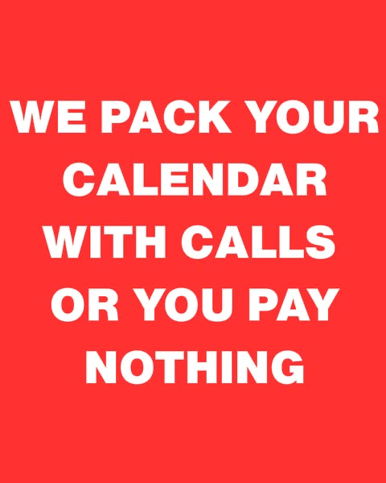
- **Advertiser:** Cole Gordon (Closers.io). Started Jun 22, 2026.
- **Looks like:** Flat bright red square. Five lines of white all-caps heavy sans-serif, centered, filling about 80% of the width. Nothing else.
- **Text on image:** "WE PACK YOUR CALENDAR WITH CALLS OR YOU PAY NOTHING"
- **Primary text:** "Coaches & Marketing Agencies - We will place an appointment setter inside your business and if they don't perform - YOU DON'T PAY. Keep reading below and I'll tell you: #1 - How this works #2 - Our extensive tracking record PROVING this works..."
- **Pattern:** Text-only shout. Guarantee headline. Image = promise, primary text = proof. Two near-identical versions run side by side (one lighter red).

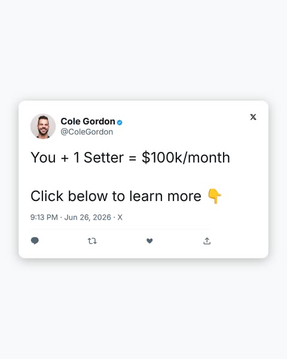
- **Advertiser:** Cole Gordon. Started Jul 1, 2026.
- **Looks like:** Off-white square with a single tweet card centered. Avatar of Cole, name "Cole Gordon" with verified check, handle @ColeGordon. Standard X icons at the bottom.
- **Text on image:** "You + 1 Setter = $100k/month" / "Click below to learn more 👇" / "9:13 PM · Jun 26, 2026 · X"
- **Primary text:** same long-form "Coaches & Marketing Agencies..." copy as above.
- **Pattern:** Tweet-screenshot ugly ad. A math-equation hook. Same primary text as the red card, different image: this is a format test, not a copy test.

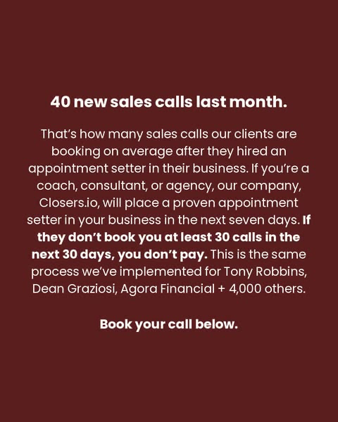
- **Advertiser:** Cole Gordon. Started Jul 7, 2026. "3 ads use this creative and text."
- **Looks like:** Dark maroon square. A bold white first line, then a paragraph of small white sans-serif text, then a bold closing line. Reads like a letter.
- **Text on image:** "40 new sales calls last month." then "That's how many sales calls our clients are booking on average after they hired an appointment setter in their business. If you're a coach, consultant, or agency, our company, Closers.io, will place a proven appointment setter in your business in the next seven days. If they don't book you at least 30 calls in the next 30 days, you don't pay. This is the same process we've implemented for Tony Robbins, Dean Graziosi, Agora Financial + 4,000 others." then "Book your call below."
- **Pattern:** Long-copy static. Proof number as the hook, guarantee in the body, name-drop proof, CTA line. Breaks the 20% text rule on purpose. A darker gray variant with "30 appointments in 30 days" runs alongside.

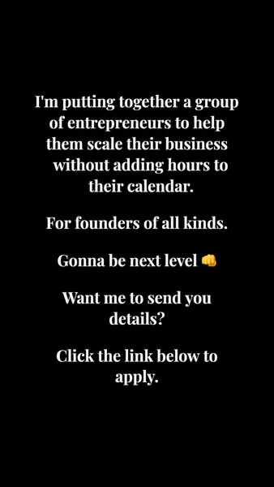
- **Advertiser:** Dan Martell. Started Jul 24, 2026. "2 ads use this creative and text."
- **Looks like:** Pure black vertical card with centered white serif text in short stacked lines, like a Story or a note.
- **Text on image:** "I'm putting together a group of entrepreneurs to help them scale their business without adding hours to their calendar. For founders of all kinds. Gonna be next level 👊 Want me to send you details? Click the link below to apply."
- **Pattern:** Notes-style ugly ad, application funnel. No headline, no offer name, no logo. The image IS the copy. A brick-orange variant ("Growing the hard way? My private advisory group is open. $1-$5M owners.") runs next to it.

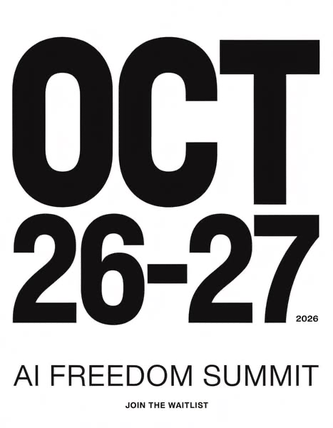
- **Advertiser:** Dan Martell. Started Aug 20, 2026.
- **Looks like:** White vertical canvas. "OCT 26-27" in enormous black condensed type filling the top two-thirds; tiny "2026" beside it. Below, light sans-serif "AI FREEDOM SUMMIT" and tiny "JOIN THE WAITLIST".
- **Text on image:** "OCT 26-27 2026 / AI FREEDOM SUMMIT / JOIN THE WAITLIST"
- **Primary text:** "DO NOT JOIN this waitlist if AI is a hobby for you. I mean that. These two days are built for founders with payroll going out every month and clients waiting on work... Oct 26 and 27 in Kelowna, I'm teaching the AI playbooks we use across dozens of companies."
- **Pattern:** Typography-only event card. One giant element (the date) and nothing else. The primary text does the selling with a "do not" reverse hook.

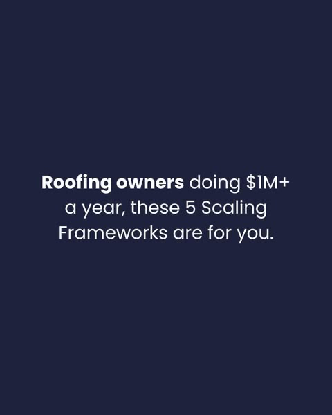
- **Advertiser:** Alex Hormozi. Started Jun 22, 2026.
- **Looks like:** Flat dark navy vertical card. Three lines of white sans-serif centered, with the audience name in bold.
- **Text on image:** "**Roofing owners** doing $1M+ a year, these 5 Scaling Frameworks are for you."
- **Primary text:** "Business Owners, real quick, can I get your email? I want to send you the exact frameworks we've used to scale: Sales, Teams, Communication, Compensation, Worker productivity. These are the same systems we implement across our portfolio companies, and you can get them for free."
- **Link headline:** "Download Free Scaling Frameworks" (acquisition.com)
- **Pattern:** Text-only audience callout. Same card runs for Accounting firms, Pest control owners, Mortgage brokerage owners, Law firms. One layout, five audiences, all live since June.

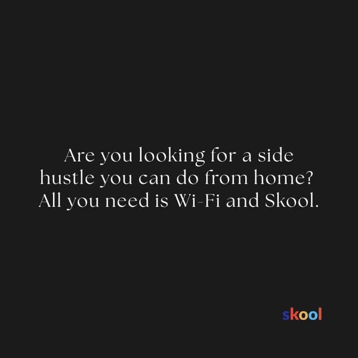
- **Advertiser:** Skool. Started Jul 25, 2026. "2 ads use this creative and text."
- **Looks like:** Near-black square, three lines of thin white serif centered, tiny colored "skool" wordmark bottom-right.
- **Text on image:** "Are you looking for a side hustle you can do from home? All you need is Wi-Fi and Skool."
- **Primary text:** "👉 Join 171.9k community builders collectively earning over $1 billion per year on the Skool platform TODAY. ❤️‍🔥 Our mission: Bring community to over 1 billion people 🤝 Simple setup: Launch your community and start receiving payments in under 90 seconds..."
- **Pattern:** Question-hook text card. Elegant serif on black reads as a statement, not an ad. Logo tiny.

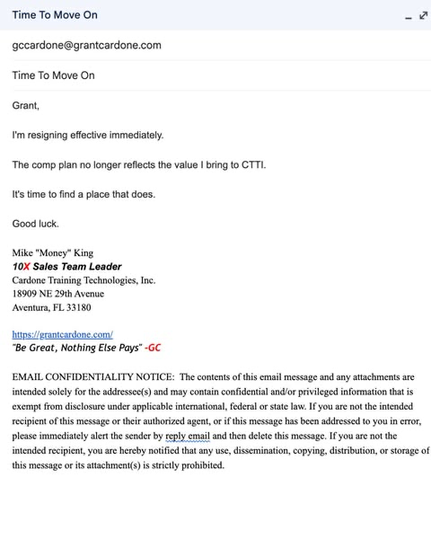
- **Advertiser:** Grant Cardone. Started Aug 19, 2026. "2 ads use this creative and text."
- **Looks like:** A plain screenshot of an email client. Subject "Time To Move On", from [email address]. Body is a short resignation letter from a sales leader, followed by a full email signature and confidentiality notice.
- **Text on image:** "Time To Move On / Grant, I'm resigning effective immediately. The comp plan no longer reflects the value I bring to CTTI. It's time to find a place that does. Good luck. Mike 'Money' King, 10X Sales Team Leader, Cardone Training Technologies, Inc..."
- **Primary text:** "'How much should I pay my salespeople?' If you're a business owner or sales manager, I bet you've asked yourself that before. And if you're scaling, you've probably wondered... 'What kind of comp structure will keep my team motivated and hungry?' I'm Grant Cardone, founder & CEO of a $600 million/year..."
- **Pattern:** Screenshot ugly ad as a story hook. The image is the problem (a salesperson quitting over comp), the copy is the solution (a comp-plan training). Zero design. Maximum curiosity.

### Format (b): Founder or face + headline

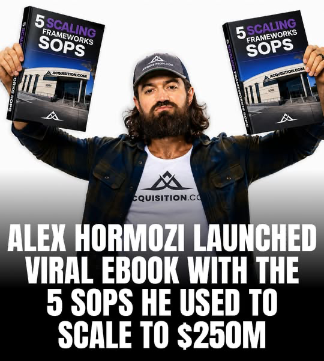
- **Advertiser:** Alex Hormozi. Started Aug 4, 2026.
- **Looks like:** Hormozi in a cap and open flannel, arms raised, holding two copies of a book titled "5 Scaling Frameworks SOPs" above his head. White background. Bottom half is a black-outlined white condensed headline, four lines, all caps.
- **Text on image:** "ALEX HORMOZI LAUNCHED VIRAL EBOOK WITH THE 5 SOPS HE USED TO SCALE TO $250M"
- **Primary text:** "Business Owners, real quick, can I get your email?..." (same lead-magnet copy)
- **Link headline:** "Download Free Scaling Frameworks"
- **Pattern:** Founder + product + news-style headline in third person. The book is the prop; the headline is written like a headline about him, not by him.

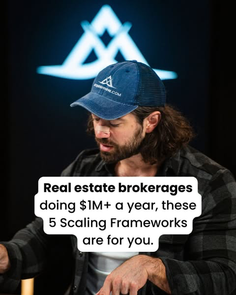
- **Advertiser:** Alex Hormozi. Started Jul 22, 2026.
- **Looks like:** Vertical. Dark studio background, Acquisition.com logo faint at top. Hormozi in a cap seated, looking down-right toward a white rounded speech bubble in the lower right.
- **Text on image (in bubble):** "**Real estate brokerages** doing $1M+ a year, these 5 Scaling Frameworks are for you."
- **Pattern:** Founder + speech-bubble audience callout. Same words as the navy text-only version, plus the face. Direct A/B of format (a) vs (b).

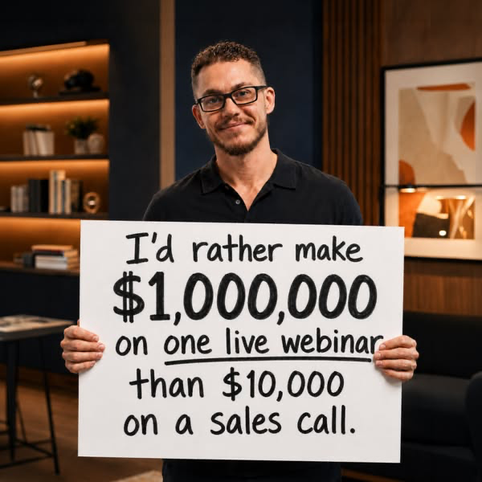
- **Advertiser:** Dan Henry. Started Aug 2, 2026.
- **Looks like:** Dan in glasses and a black polo, standing in a warm office, holding a white whiteboard with black marker handwriting.
- **Text on image:** "I'd rather make $1,000,000 on one live webinar than $10,000 on a sales call." ("one live webinar" underlined)
- **Primary text:** "The better your webinar content, the worse it converts! I know that sounds backwards, but hear me out. After doing over $40M in webinar sales and consulting on dozens of seven and eight figure launches..."
- **Pattern:** Founder holding a handwritten sign. Contrast headline (big number vs small number). Zero design, all trust.

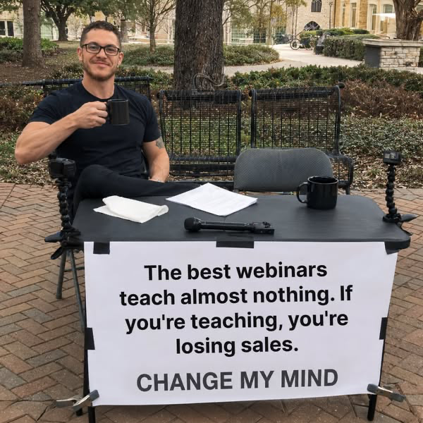
- **Advertiser:** Dan Henry. Started Aug 17, 2026.
- **Looks like:** The "Change My Mind" meme setup. Dan sits at a black folding table outdoors on a brick path with a mug, papers, and a mic. A white banner taped to the table front carries the claim.
- **Text on image:** "The best webinars teach almost nothing. If you're teaching, you're losing sales." then "CHANGE MY MIND"
- **Pattern:** Founder + meme template. Contrarian claim. Three variants run with different banner lines: "If your webinar feels like hard work, you built it wrong. Period." and "Your sales team is obsolete. One webinar can outsell all of them."

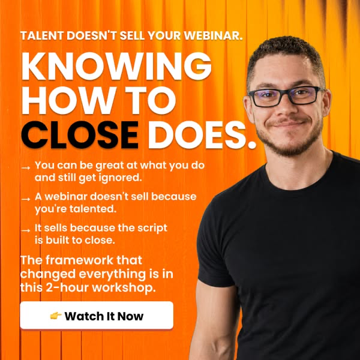
- **Advertiser:** Dan Henry. Started Aug 16, 2026.
- **Looks like:** Bright orange background with light rays. Dan cut out on the right in a black tee, smiling. Left side is a white headline stack with three arrow bullets and a white button.
- **Text on image:** "TALENT DOESN'T SELL YOUR WEBINAR." / "KNOWING HOW TO CLOSE DOES." (with "CLOSE" in dark) / "→ You can be great at what you do and still get ignored. → A webinar doesn't sell because you're talented. → It sells because the script is built to close." / "The framework that changed everything is in this 2-hour workshop." / button "👉 Watch It Now"
- **Pattern:** Polished founder + headline + bullets + CTA button. The "scaling" version of the same offer that the sign and meme versions are discovering.

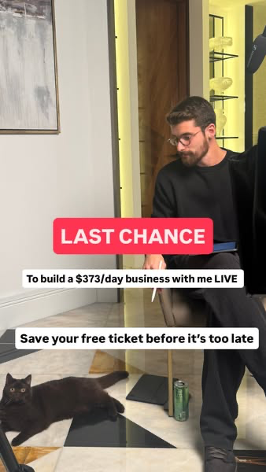
- **Advertiser:** Iman Gadzhi. Started Aug 28, 2026. "6 ads use this creative and text."
- **Looks like:** Vertical candid phone photo. Iman in glasses sits on a chair in a hallway looking at his phone; a black cat lies on the tiled floor; a green can sits nearby. Instagram Stories-style text pills over the photo.
- **Text on image:** red pill "LAST CHANCE" / white pill "To build a $373/day business with me LIVE" / black pill "Save your free ticket before it's too late"
- **Primary text:** "I Notice You Still Haven't Registered for the Side Hustle Summit... Time's Almost Up. Keep in mind, this is the first time ever you'll have an opportunity to learn from my mentor, a multi-billion dollar entrepreneur, for FREE. We'll show you how to build a $373 a day AI side hustle in just five days."
- **Pattern:** Lo-fi founder photo with native Stories labels. Runs alongside a fully polished red-gradient "LAST CHANCE" studio version with identical words. Textbook ugly-vs-polished test.

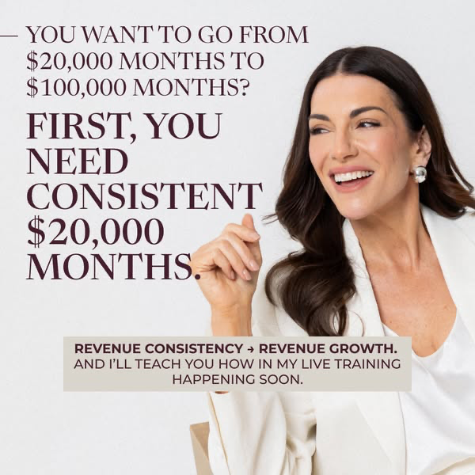
- **Advertiser:** Amy Porterfield. Started Aug 11, 2026.
- **Looks like:** Landscape, editorial magazine style. Left: dark serif headline stack on cream. Right: Amy in a white blazer laughing, hand near her face. A dark bar across the lower left with a small caps subline.
- **Text on image:** "YOU WANT TO GO FROM $20,000 MONTHS TO $100,000 MONTHS? FIRST, YOU NEED CONSISTENT $20,000 MONTHS." / bar: "REVENUE CONSISTENCY → REVENUE GROWTH. AND I'LL TEACH YOU HOW IN MY LIVE TRAINING HAPPENING SOON."
- **Primary text:** "When your revenue is impressive, your audience is ride or die, and your reputation is solid, it can feel a little embarrassing to still feel so all over the place. 😵‍💫 Some months absolutely crush it. 🏆..."
- **Pattern:** Founder + transformation headline (from X to Y with a twist). Editorial serif styling for a premium female-founder audience.

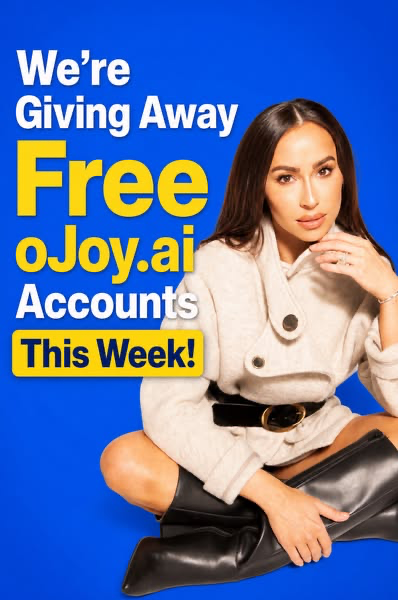
- **Advertiser:** Frank Kern (promoting oJoy.ai). Started Jul 26, 2026.
- **Looks like:** Vertical royal-blue canvas. Top: white heavy headline with "Free oJoy.ai" in yellow and a yellow "This Week!" pill. Bottom 60%: a woman in a cream jacket and black boots sits on the floor, cut out on the blue.
- **Text on image:** "We're Giving Away Free oJoy.ai Accounts This Week!"
- **Link headline:** "oJoy.ai / By Invitation Only / Learn more"
- **Pattern:** Face + free-offer headline. Kern runs six variants: same layout in blue, red, pink, yellow, with different poses and one plain text-only version. Color is the test variable.

### Format (c): Before / after or transformation (word and price versions)

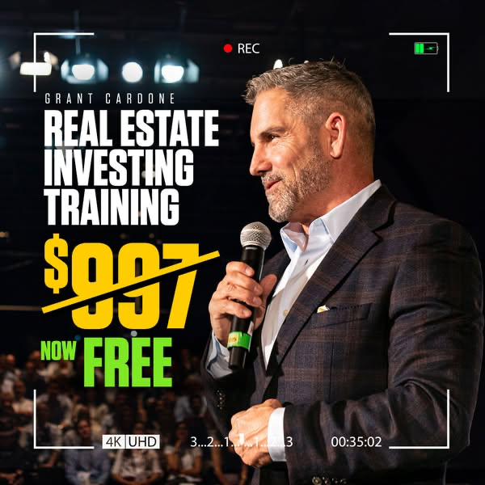
- **Advertiser:** Grant Cardone. Started Aug 13, 2026.
- **Looks like:** Square, dark event photo of Grant with a mic, camcorder-style REC overlay and corner brackets (looks like a live recording). Left side white condensed caps headline, then "$997" struck through in yellow, then "NOW FREE" in bright green.
- **Text on image:** "GRANT CARDONE REAL ESTATE INVESTING TRAINING" / "$997" (struck) / "NOW FREE" / "4K UHD" / "REC"
- **Primary text:** "I turned $3,000 into $3 million on my very first real estate deal. No license. No experience. No wealthy family. Just a strategy that works, and I'm showing it to you for free."
- **Pattern:** Price before/after. Green FREE is the loudest element. The camcorder UI is a native-feel trick.

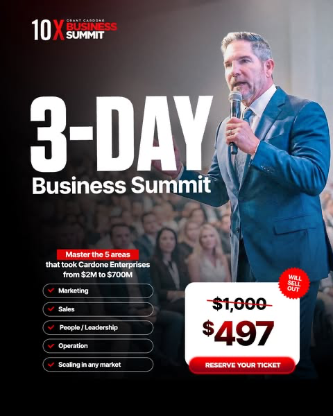
- **Advertiser:** Grant Cardone. Started Jun 24, 2026.
- **Looks like:** Grant on stage with a mic, crowd behind, "10X Business Summit" logo top-left. Huge white "3-DAY Business Summit" headline. Left: red panel with five red check-mark bullets. Bottom-right: white panel with "$1,000" struck through and "$497" in red, red "RESERVE YOUR TICKET" button, red "WILL SELL OUT" badge.
- **Text on image:** "3-DAY Business Summit / Master the 5 areas that took Cardone Enterprises from $2M to $700M / Marketing, Sales, People / Leadership, Operation, Scaling in any market / $1,000 → $497 / WILL SELL OUT / RESERVE YOUR TICKET"
- **Pattern:** Offer stack with price before/after. Everything on one canvas: proof number, bullets, price drop, urgency, CTA. Runs in three layouts (square, vertical, two-speaker) since June.

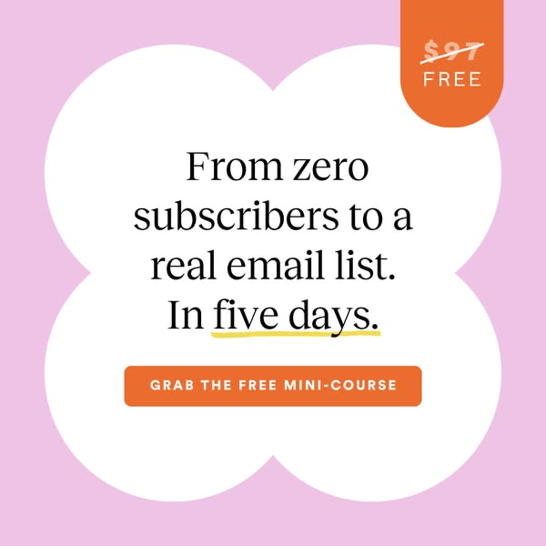
- **Advertiser:** Jenna Kutcher. Started Apr 15, 2026.
- **Looks like:** Pink square with a big white flower-shaped blob in the center. Orange tab top-right: "$97" struck through, "FREE". Serif headline in the blob, orange button under it.
- **Text on image:** "$97 FREE" / "From zero subscribers to a real email list. In five days." ("five days" underlined) / button "GRAB THE FREE MINI-COURSE"
- **Primary text:** "You *could* spend another year wrestling with the social media algorithm just to get any of your followers to see your work and your offers... OR you could finally start that EMAIL LIST you've been needing... And you can do it for FREE!"
- **Pattern:** Transformation headline ("from zero to a real list") plus price before/after badge. Running since April: a proven lead magnet.

### Format (d): Testimonial / review / proof stack

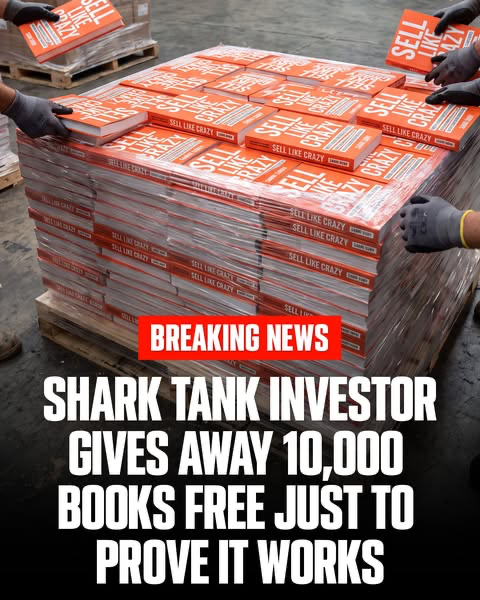
- **Advertiser:** Sabri Suby. Started Aug 24, 2026.
- **Looks like:** Vertical phone photo of shrink-wrapped pallets stacked with red-and-white "Sell Like Crazy" books in a warehouse, gloved hands on top. Red "BREAKING NEWS" tag, then white condensed caps headline with a shadow.
- **Text on image:** "BREAKING NEWS" / "SHARK TANK INVESTOR GIVES AWAY 10,000 BOOKS FREE JUST TO PROVE IT WORKS"
- **Primary text:** "'I'm giving away 10,000 free copies of my #1 bestselling book that creates a torrential downpour of customers for any business'... Yep, the same book that retails for $23.95 and has 6,500+ reviews at 4.8 stars... 💰 $7.8b in sales generated 🔑 1,067 different niches 💵 87 millionaires created"
- **Pattern:** Proof stack (physical volume) + news framing + third-person headline. Suby runs eight variants: pallets, his face with a pallet inset, a table of books, "NEWS" vs "BREAKING NEWS" tags.

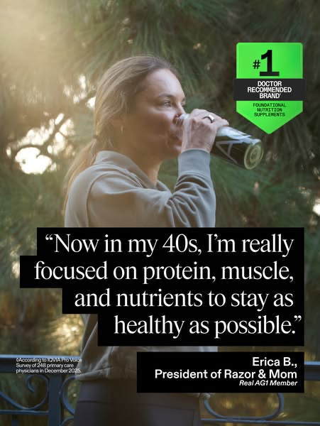
- **Advertiser:** AG1 by Athletic Greens. Started May 5, 2026.
- **Looks like:** Vertical. Woman in her 40s drinking from a green bottle under trees in golden light. A green "#1 Doctor Recommended Brand" badge top-right. Lower half: black panel with a white serif quote and name.
- **Text on image:** "'Now in my 40s, I'm really focused on protein, muscle, and nutrients to stay as healthy as possible.' Erica B., President of Razor & Mom, Real AG1 Member" / badge "#1 DOCTOR RECOMMENDED BRAND, Foundational nutrition supplements"
- **Link headline:** "75+ Daily Nutrients for Your Best Decade / The Daily Health Drink / Learn More"
- **Pattern:** Testimonial quote over a lifestyle photo with name, title, and a "real member" tag. A second Erica variant (walking a dog) has run since the same period.

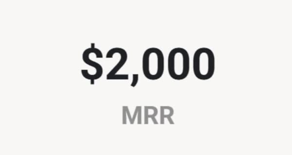
- **Advertiser:** Skool. Started Jul 11, 2026.
- **Looks like:** Off-white square. One giant black "$2,000" and a gray "MRR" under it. Nothing else.
- **Text on image:** "$2,000 / MRR"
- **Link headline:** "Skool / Skool is a community platform. You can discover communities or create your own... People earn full-time incomes building on Skool. You can, too!"
- **Pattern:** Stat card. One number as the whole ad. The description under the image explains it.

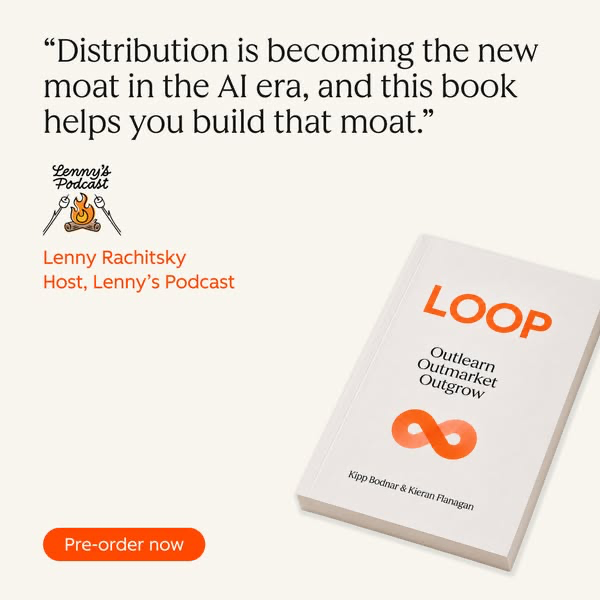
- **Advertiser:** HubSpot. Started Jul 29, 2026.
- **Looks like:** Cream landscape card. Large serif quote top-left, name and podcast credit with a small logo, the "LOOP" book cover angled bottom-right, orange "Pre-order now" button.
- **Text on image:** "'Distribution is becoming the new moat in the AI era, and this book helps you build that moat.' Lenny Rachitsky, Host, Lenny's Podcast" / book: "LOOP, Outlearn Outmarket Outgrow" / button "Pre-order now"
- **Primary text:** "The marketing book for the AI era is here. Pre-order 'Loop: Outlearn. Outmarket. Outgrow.'"
- **Pattern:** Endorsement quote + product hero + CTA. Third-party credibility beats self-praise for a book launch.

### Format (e): Product or book hero with benefit callouts

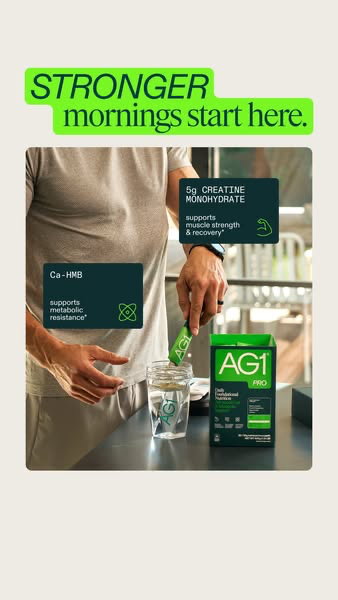
- **Advertiser:** AG1. Started Jun 16, 2026.
- **Looks like:** Vertical. A hand tears open a green AG1 Pro packet over a glass on a kitchen counter, the AG1 Pro pouch beside it. Green highlight headline top-left. Two dark callout cards float beside the product.
- **Text on image:** "STRONGER mornings start here." / callouts "5g CREATINE MONOHYDRATE, supports muscle strength & recovery*" and "Ca-HMB, supports metabolic resistance*"
- **Primary text:** "AG1 Pro delivers advanced muscle and gut support built on the foundation of AG1 Next Gen.* Stronger mornings start here. Make a Pro move."
- **Pattern:** Product in use + two ingredient callouts. Headline is an outcome, callouts are the mechanism.

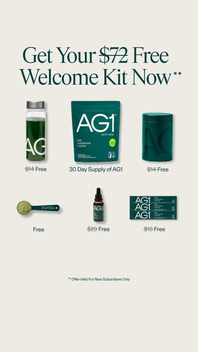
- **Advertiser:** AG1. Started Feb 24, 2026 (longest-running swipe in this set).
- **Looks like:** Cream vertical flat lay. Serif headline top. Six items in a grid (bottle, pouch, canister, scoop, dropper, travel packs) each with a small price label under it.
- **Text on image:** "Get Your $72 Free Welcome Kit Now**" / "$14 Free, 30 Day Supply of AG1, $14 Free, Free, $29 Free, $15 Free" / "**Offer Valid For New Subscribers Only"
- **Primary text:** "Ready to upgrade your health routine? Most supplements aren't backed by science. AG1 Next Gen is... Act now and get: ✔️ 3 FREE Travel Packs ✔️ FREE Bottle..."
- **Pattern:** Flat-lay bundle with itemized value. Running six-plus months. The dollar figure in the headline is the total of the labels.

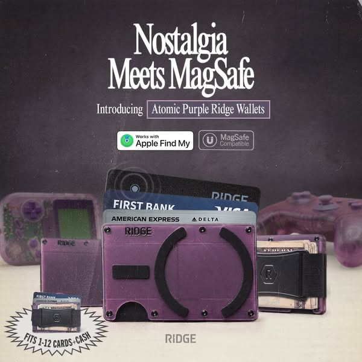
- **Advertiser:** The Ridge. Started Jul 18, 2026.
- **Looks like:** Square. Purple translucent wallet with cards fanned out, on a dark purple set with a translucent game console and controller behind it (90s clear-tech nostalgia). White serif headline top, small "Introducing Atomic Purple Ridge Wallets" line, two compatibility badges, a stamp-style "FITS 1-12 CARDS+CASH" badge bottom-left, small RIDGE logo bottom.
- **Text on image:** "Nostalgia Meets MagSafe" / "Introducing Atomic Purple Ridge Wallets" / "Works with Apple Find My" / "MagSafe Compatible" / "FITS 1-12 CARDS+CASH"
- **Primary text:** "Introducing the Limited Edition Atomic Purple Wallet. Straight from the clear-tech era. Holds 1-12 cards, blocks RFID, and comes with a Built-for-Life warranty."
- **Pattern:** Product hero in a themed set + three feature badges. Limited-edition angle.

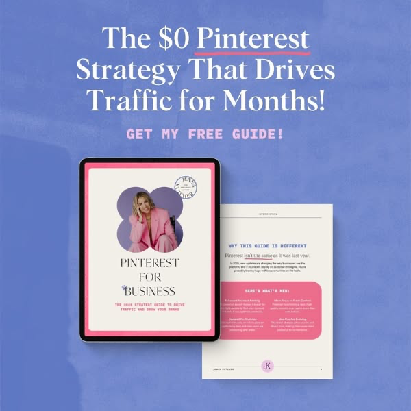
- **Advertiser:** Jenna Kutcher. Started May 21, 2026.
- **Looks like:** Textured blue square. White serif headline top with "$0" and "Months" underlined. A tablet mockup showing the guide cover ("Pinterest for Business") plus a printed page behind it.
- **Text on image:** "The $0 Pinterest Strategy That Drives Traffic for Months!" / pink caps "GET MY FREE GUIDE!"
- **Primary text:** "🚨 Pinterest has changed. If you're using the same old strategies, you're already behind. I figured out how to turn one hour a week into an automated traffic system that brought me millions of views without ads..."
- **Pattern:** Lead magnet shown as a physical product (device mockup). The deliverable is visible, which raises perceived value of a free PDF.

### Format (g): Meme / native / lo-fi

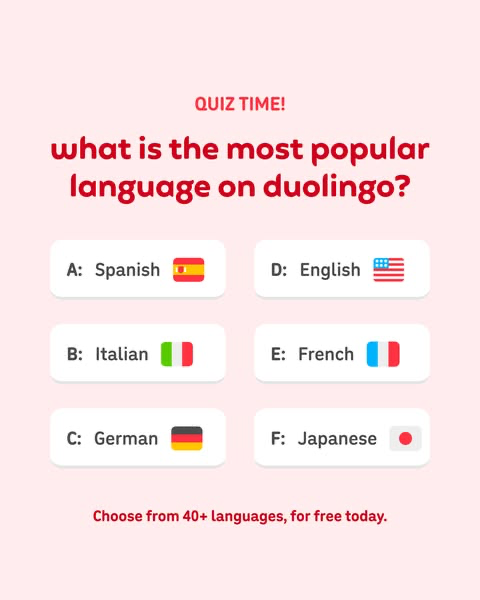
- **Advertiser:** Duolingo. Started Jun 30, 2026.
- **Looks like:** Vertical pale-pink canvas. Red caps "QUIZ TIME!", a red question headline, six white answer tiles with flags (A: Spanish, B: Italian, C: German, D: English, E: French, F: Japanese), small red footer line.
- **Text on image:** "QUIZ TIME! what is the most popular language on duolingo?" / "Choose from 40+ languages, for free today."
- **Link headline:** "Free Language Learning / Install Now"
- **Pattern:** Native interactive-looking static. A quiz the reader answers in their head. No product shot, no CTA button on the image.

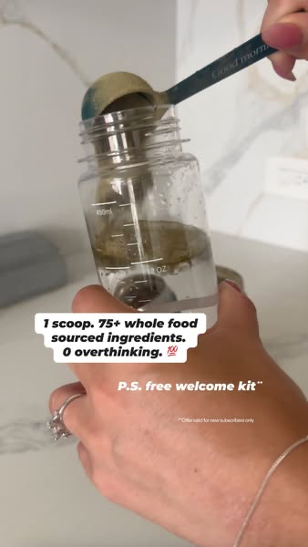
- **Advertiser:** Hannah Ski with AG1 (partnership ad). Started Jul 27, 2026. "4 ads use this creative and text."
- **Looks like:** Vertical phone photo, overhead, a hand scooping green powder into a shaker on a marble counter. Two white Stories-style text pills near the bottom, one with a yellow italic line.
- **Text on image:** "1 scoop. 75+ whole food sourced ingredients. 0 overthinking. 💯" / "P.S. free welcome kit**"
- **Primary text:** "💪 90 Days of AG1. Lock In. Level Up.🏃‍♀️ AG1 is a daily, drinkable multivitamin with probiotics and nutrients that support energy, immunity, and gut health..."
- **Pattern:** UGC still with native text labels. Creator partnership ad (shows creator name + brand). Product in hand, not on a pedestal.

### Format (h): Offer / discount / free thing

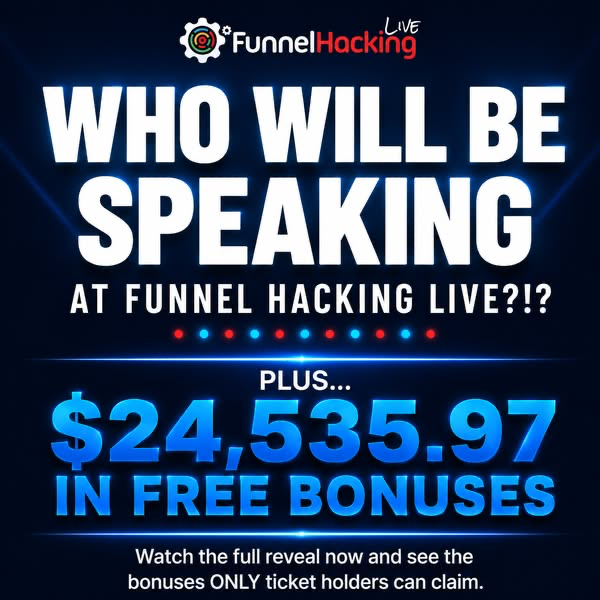
- **Advertiser:** Russell Brunson (Funnel Hacking Live). Started Aug 24, 2026.
- **Looks like:** Square, dark navy with a Funnel Hacking Live logo top. Giant white condensed caps question headline, a row of red dots, then "PLUS..." and a huge blue-gradient dollar amount, then a small white line.
- **Text on image:** "WHO WILL BE SPEAKING AT FUNNEL HACKING LIVE?!?" / "PLUS... $24,535.97 IN FREE BONUSES" / "Watch the full reveal now and see the bonuses ONLY ticket holders can claim."
- **Primary text:** "Who's speaking at Funnel Hacking Live 2026? 👀 The speaker lineup is being revealed... And there are a few names you probably won't expect..."
- **Pattern:** Curiosity question + oddly specific bonus number. Six layout variants running (square, vertical, stage photo, crowd photo). The specific cents ($24,535.97) is a classic believability trick.

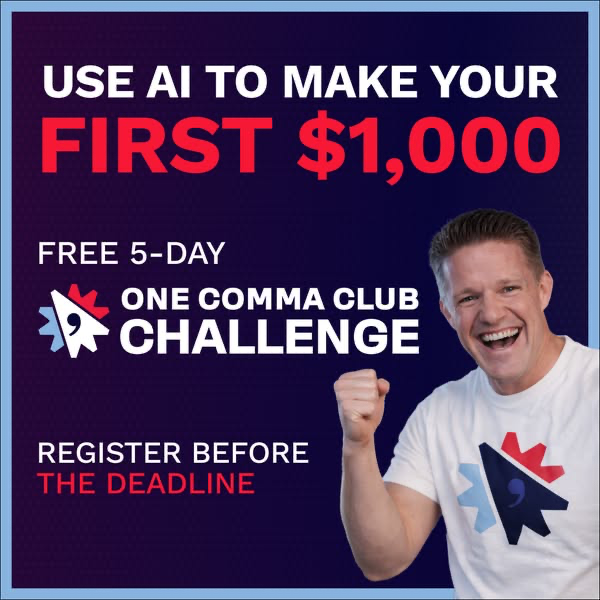
- **Advertiser:** ClickFunnels. Started Jun 25, 2026.
- **Looks like:** Square, blue-to-navy background with a light-blue border. Headline top in white with "FIRST $1,000" in red. Russell Brunson cut out bottom-right in a white tee, fist pumping. "FREE 5-DAY" and the One Comma Club Challenge logo mid-left, "REGISTER BEFORE THE DEADLINE" bottom-left with the last line in red.
- **Text on image:** "USE AI TO MAKE YOUR FIRST $1,000" / "FREE 5-DAY ONE COMMA CLUB CHALLENGE" / "REGISTER BEFORE THE DEADLINE"
- **Primary text:** "Wanna Make Your First $1,000 Online? Join our FREE proven 5-Day system and discover the secret to go from $0 to $1,000 even if you don't have a business or idea..."
- **Pattern:** Free challenge offer card with founder. Outcome + FREE + deadline. Note the AI angle added to a years-old challenge.

### Format (i): Free training / lead-magnet card

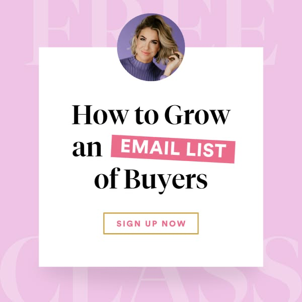
- **Advertiser:** Jenna Kutcher. Started Sep 10, 2025 (running almost a full year).
- **Looks like:** Pink square with faint oversized "FREE" and "CLASS" outline words behind. Centered white card with a circular photo of Jenna at the top, black serif headline with "EMAIL LIST" inside a pink highlight bar, and an outlined yellow "SIGN UP NOW" button.
- **Text on image:** "FREE CLASS" (background) / "How to Grow an EMAIL LIST of Buyers" / "SIGN UP NOW"
- **Primary text:** "I'll say it: the rest of your goals for your business might not matter as much as THIS one should. 👇 If you don't have an email list, you don't have a DIRECT line to your customers..."
- **Pattern:** Classic free-class card: avatar, outcome headline, highlight on the key phrase, one button. The longest-running info-product swipe in this set.

### Format (j): Chart / dashboard / results screenshot

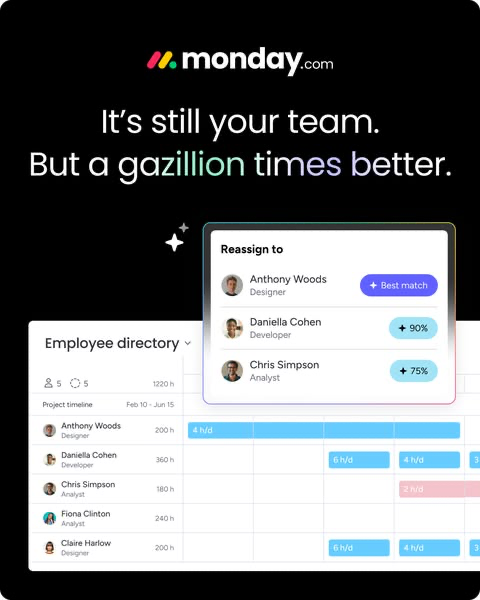
- **Advertiser:** monday.com. Started May 12, 2026.
- **Looks like:** Vertical black canvas. monday.com wordmark top. Two-line white headline with "gazillion" in a green-blue gradient. Below: a tilted white dashboard screenshot (Employee directory table with progress bars) and a floating "Reassign to" popup listing three people with "Best match / 90% / 75%" tags.
- **Text on image:** "It's still your team. But a gazillion times better." / UI: "Reassign to, Anthony Woods (Best match), Daniella Cohen (90%), Chris Simpson (75%), Employee directory..."
- **Primary text:** "There's a reason why 180K+ customers use monday.com to efficiently manage their teams, work and processes. See why."
- **Pattern:** Headline + product UI screenshot. The screenshot is the proof of "better." Legible UI text, one highlighted popup.

### Format (k): Quote card

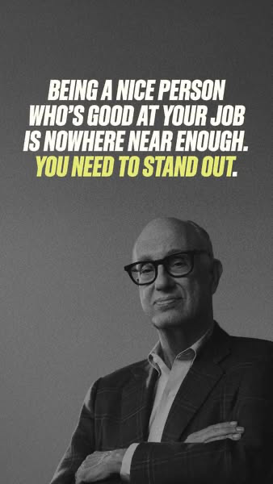
- **Advertiser:** MasterClass. Started Jul 30, 2026.
- **Looks like:** Vertical black-and-white photo of an older man in a suit with glasses, arms crossed, dark gray background. Upper third: heavy condensed caps white quote, last line in yellow.
- **Text on image:** "BEING A NICE PERSON WHO'S GOOD AT YOUR JOB IS NOWHERE NEAR ENOUGH." / "YOU NEED TO STAND OUT."
- **Link headline:** "Power: Use It or Lose It / The CEO playbook / Sign Up"
- **Pattern:** Quote card over a B&W portrait. Contrarian belief + yellow punchline. Negative space above the subject holds the text.

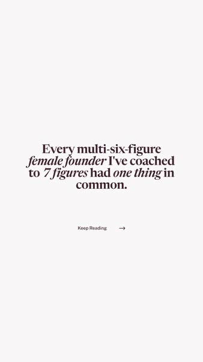
- **Advertiser:** Amy Porterfield. Started Aug 12, 2026. "4 ads use this creative and text."
- **Looks like:** Off-white square. Centered dark serif sentence with italic emphasis on key words. A tiny "Keep Reading →" under it.
- **Text on image:** "Every multi-six-figure female founder I've coached to 7 figures had one thing in common." / "Keep Reading →"
- **Primary text:** "Your business is making multiple six figures. So why can't you explain why one month outperforms another? That's a very different problem than trying to make your first sale..."
- **Pattern:** Open-loop quote card. The image withholds the answer; "Keep Reading" pushes the eye to the primary text. Elegant, no logo, no offer on the image.

---

## Sources

Ad swipes: Meta Ad Library, US, active ads, captured Sep 2, 2026. https://www.facebook.com/ads/library/

Static ad formats and benchmarks (2026):
- Motion, Creative Benchmarks 2026 (top visual formats, top asset types): https://motionapp.com/library/research/creative-benchmarks-2026/ and https://motionapp.com/library/research/creative-benchmarks-2026/top-visual-formats and https://motionapp.com/library/research/creative-benchmarks-2026/top-asset-types
- Superscale, "Static ads in 2026: the performance marketer's playbook": https://superscale.ai/learn/static-ads/
- Superscale, "Meta ad sizes 2026": https://superscale.ai/learn/meta-ad-sizes
- Taylor Sicard, "Meta Ads Creative Benchmarks 2026: Hook Rate, Hit Rate and Volume": https://taylorsicard.com/blog/meta-ads-creative-benchmarks-2026
- AdLibrary.com, "Meta Ads Creative Best Practices: 2026 Field Guide": https://adlibrary.com/posts/meta-ads-creative-best-practices
- Favoured, "Ugly Ad Creative: Why the Best Meta Ads Look Worse in 2026": https://favoured.co.uk/ugly-ad-creative-2026/
- Dataslayer, "Meta Ad Formats 2026" (format CPA ranges): https://www.dataslayer.ai/blog/meta-ad-formats-in-2025-guide
- Adrio, "7 best Meta ad formats for static ads in 2026": https://adrio.ai/blog/best-meta-ad-formats
- GetHookd, "7 Effective Static Ads Examples Worth Copying in 2026": https://www.gethookd.ai/learn/7-effective-static-ads-examples-worth-copying-in-2026/
- Hootsuite, "Facebook ad sizes and specs cheat sheet for 2026": https://blog.hootsuite.com/facebook-ad-sizes/

Image models (2026):
- OpenAI, GPT Image models prompting guide (gpt-image-2 sizes, quality, text tips, edit patterns): https://developers.openai.com/cookbook/examples/multimodal/image-gen-models-prompting-guide
- Google, Gemini API image generation docs (Nano Banana model IDs, aspect ratios, resolutions, reference limits, SynthID): https://ai.google.dev/gemini-api/docs/image-generation
- Google Cloud, "Ultimate prompting guide for Nano Banana": https://cloud.google.com/blog/products/ai-machine-learning/ultimate-prompting-guide-for-nano-banana
- fal.ai, "GPT Image 2 vs. Nano Banana 2: What's The Difference?" (ratios, pricing, reference limits): https://fal.ai/learn/tools/gpt-image-2-vs-nano-banana-2
- OakGen, "GPT Image 2 vs Nano Banana Pro: Tested on 20 Prompts" (text, realism, editing scores): https://oakgen.ai/blog/gpt-image-2-vs-nano-banana-pro
- nanobanana.org, "GPT Image 2 vs Nano Banana Pro" (99% vs 94% text accuracy): https://nanobanana.org/posts/gpt-image-2-vs-nano-banana-pro
- XDA, "I compared ChatGPT Images 2.0 and Gemini Nano Banana" (reference likeness): https://www.xda-developers.com/compared-chatgpt-images-2-0-and-gemini-nano-banana/
- Picsart, "How to prompt GPT Image 2": https://picsart.com/blog/gpt-image-2-prompts/
- Atlabs, "Ultimate Nano Banana Pro Prompting Guide": https://www.atlabs.ai/blog/the-ultimate-nano-banana-pro-prompting-guide-mastering-gemini-3-pro-image
- Sunra, "Nano Banana 2 vs GPT Image 2 (2026)": https://sunra.ai/blog/nano-banana-2-vs-gpt-image-2
